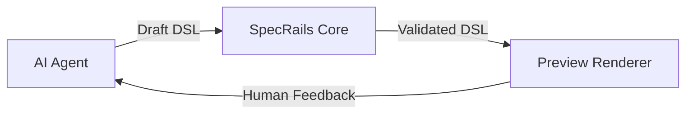

# 🧩 **SpecRails Preview Principle**

## 🎯 Основная идея

> **Preview** — это не часть ядра SpecRails, а доверенный интерфейс визуальной валидации, предназначенный для участия человека в двухконтурной модели проверки.
> Он обеспечивает связь между аналитиком, AI и ядром, предоставляя визуальное представление артефактов (DSL) и контекст для смысловой проверки.

---

## ⚙️ Архитектурный статус

| Компонент                    | Роль                                             | Принадлежность к ядру             |
| ---------------------------- | ------------------------------------------------ | --------------------------------- |
| **Core Engine**              | Компиляция, валидация и нормализация DSL         | ✅ Да                              |
| **Preview Renderer**         | Визуализация результата для восприятия человеком | ⚙️ Нет, но интегрирован через API |
| **Human Feedback Interface** | Канал обратной связи от аналитика                | ❌ Внешний слой                    |
| **AI Agent**                 | Генерация и корректировка черновиков             | ❌ Внешний слой                    |

Preview — это не логическая часть ядра, но **обязательный компонент полного цикла валидации**, обеспечивающий визуальную проверку и UX-фидбек.

---

## 🧠 Функции Preview

1. **Отображение DSL в удобной визуальной форме**
   Формы, страницы, ACL-таблицы, диаграммы моделей — без потери структуры.
2. **Визуальная валидация**
   Аналитик подтверждает, что визуальный результат соответствует смыслу описания.
3. **Интерактивная корректировка**

   * Команды в стиле: *«сделай поле скрытым»*, *«перемести блок выше»*.
   * AI агент обновляет DSL.
4. **Диалог с ядром**
   Все изменения проходят повторную формальную валидацию Core.

---

## 🔁 Позиция в Validation Loop

Preview — **глаз** системы: он не принимает решений, но предоставляет человеку возможность увидеть результат машинной проверки и инициировать следующую итерацию.

---

## 🧩 Взаимодействие с ядром

| Направление    | Тип данных         | Формат       | Примечание                             |
| -------------- | ------------------ | ------------ | -------------------------------------- |
| Core → Preview | Валидированный DSL | JSON / YAML  | Только read-only данные                |
| Preview → Core | Команды и правки   | Event Stream | Передаются через AI Agent или напрямую |
| Preview → AI   | Feedback / Prompt  | Natural Text | Контекст для re-generation             |

---

## 🧱 Архитектурный принцип

> **Preview — это слой восприятия, а не вычисления.**
> Он не знает, как устроен DSL внутри, но умеет интерпретировать результат по публичному контракту ядра.

---

## 🔒 Цели и ограничения

| Цель                                      | Реализация                                              |
| ----------------------------------------- | ------------------------------------------------------- |
| Минимальная зависимость от UI-фреймворков | Использование базового HTML/Template Engine             |
| Простота расширения                       | Renderer подключается как плагин                        |
| Поддержка обратной связи                  | Интерактивные элементы для комментариев и промтов       |
| Независимость от AI                       | Может использоваться автономно, как валидатор человеком |

---

## 🧭 Стратегический вывод

> Preview не часть ядра, но часть системы валидации.
> Оно обеспечивает *человеческую достоверность* в механизме машинной проверки.
> Без Preview SpecRails остаётся функциональным, но теряет понятность;
> с Preview — становится инструментом инженерного мышления, а не просто генератором DSL.
