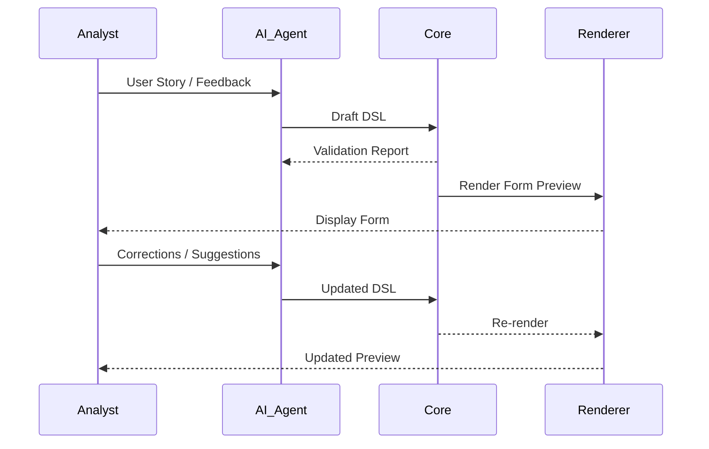

# 🔁 **SpecRails Validation Loop Principle**

## 🎯 Основная идея

> SpecRails использует **двухконтурную модель валидации**: машинную и человеческую.
> AI агент создаёт черновой DSL, SpecRails Core формально проверяет его, а аналитик визуально подтверждает смысл и логику.
> Вместе они формируют итерационный цикл *«AI ⇄ Core ⇄ Analyst»*, обеспечивающий предсказуемость, прозрачность и качество спецификаций.

---

## ⚙️ 1. Machine Validation (Core Loop)

**Задача:** проверить корректность и совместимость спецификации без участия человека.

### Включает:

* **Синтаксическую проверку** (валидный YAML/JSON);
* **Проверку структуры** по JSON Schema;
* **Проверку типов и атрибутов** (например, `type: date` должен иметь `min` и `max`);
* **Сборку составных форм** (`include`, `component`, `use`);
* **Нормализацию** (добавление метаданных, устранение неоднозначностей);
* **Автоматический feedback** AI агенту о найденных ошибках.

### Пример:

AI сгенерировал DSL, ядро ответило:

```json
{
  "errors": [
    {"field": "email", "issue": "missing required attribute 'required'"},
    {"field": "birthDate", "issue": "invalid type: must be 'date'"}
  ],
  "valid": false
}
```

AI агент получает отчёт, корректирует промт и пересоздаёт DSL.

---

## 👁️ 2. Human Validation (Interactive Visual Loop)

**Задача:** аналитик визуально проверяет смысл и UX-логическую правильность формы.

### Процесс:

1. SpecRails Core передаёт валидный DSL в **Renderer**.
2. Аналитик видит форму в preview.
3. Если что-то не соответствует ожиданиям:

   * даёт корректировку AI агенту в естественном языке;
   * либо вручную правит DSL.
4. Новая версия снова проходит **Core Validation Loop**.

### Пример диалога:

> Аналитик: «Поле *дата рождения* должно быть обязательным, и его лучше разместить над email.»
> AI: обновляет DSL → Core валидирует → Renderer перерисовывает.

---

## 🔁 3. Итеративный цикл



---

## 🧠 Архитектурные принципы

| Принцип                                | Смысл                                                               |
| -------------------------------------- | ------------------------------------------------------------------- |
| **AI — генератор смысла**              | Преобразует естественный язык в формализованный DSL.                |
| **Core — арбитр формальной истины**    | Гарантирует структурную и логическую корректность.                  |
| **Аналитик — арбитр смысловой истины** | Подтверждает, что форма отражает бизнес-логику.                     |
| **Валидация — итеративна**             | Ошибки возвращаются либо AI, либо пользователю до финальной версии. |

---

## 🔒 Результаты и преимущества

| Параметр            | Что обеспечивает                                                         |
| ------------------- | ------------------------------------------------------------------------ |
| **Consistency**     | Любой AI или человек, при тех же входных данных, получит одинаковый DSL. |
| **Transparency**    | Аналитик видит процесс, а не «чёрный ящик».                              |
| **Quality Control** | Ошибки ловятся до этапа разработки.                                      |
| **Learning Loop**   | AI улучшает качество ответов на основе логов валидации.                  |

---

## 🧭 Стратегический вывод

> **AI создаёт. Core проверяет. Аналитик утверждает.**
> Только совместная работа этих трёх ролей превращает естественный текст в достоверную инженерную спецификацию.
