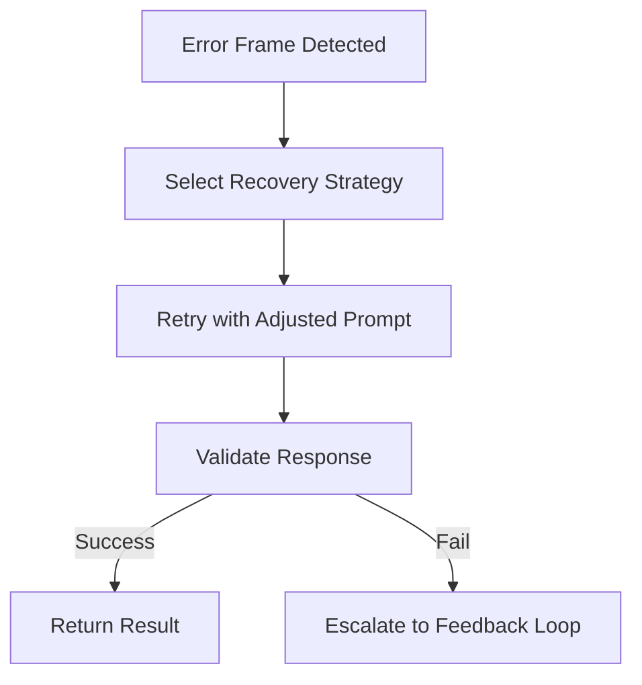

# 🔄 **SpecRails AI Interaction Protocols & Communication Contracts**

## 🎯 Цель

> Определить принципы и протоколы взаимодействия между SpecRails и AI-агентами, описать структуру сообщений, механизмы восстановления, форматы обмена и контракты коммуникации, обеспечивающие стабильность и предсказуемость.

---

## 🧩 1. Архитектурная роль

| Компонент                  | Назначение                                                              |
| -------------------------- | ----------------------------------------------------------------------- |
| **AI Session Manager**     | Управляет жизненным циклом диалога с AI, хранит состояние и историю     |
| **Prompt I/O Handler**     | Формирует запросы и интерпретирует ответы AI в рамках контрактов        |
| **Communication Contract** | Формализирует структуру и типы сообщений между SpecRails и AI           |
| **Error Frame System**     | Обрабатывает ошибки и отклонения от ожидаемого формата                  |
| **Recovery Stream**        | Обеспечивает восстановление после ошибок и повторные итерации генерации |

---

## 🧠 2. Цели протокола взаимодействия

1. Сделать взаимодействие AI ↔ SpecRails воспроизводимым и детерминированным.
2. Исключить «сюрпризы» при генерации — любая коммуникация должна проходить по контракту.
3. Разделить смысловые уровни сообщений: команды, данные, метаданные, контекст.
4. Свести вероятность ошибок AI к контролируемым сценариям.
5. Поддерживать постоянный диалоговый поток без потери состояния.

---

## ⚙️ 3. Типы коммуникации

| Тип                   | Описание                                              | Пример                             |
| --------------------- | ----------------------------------------------------- | ---------------------------------- |
| **Command Exchange**  | Запрос действий или генерации                         | `generate form for entity=student` |
| **Data Exchange**     | Передача структурированных данных (DSL, schema)       | YAML/JSON формы                    |
| **Meta Exchange**     | Управление сессией, параметрами и версиями контрактов | `switch contract=form.contract.v2` |
| **Feedback Exchange** | Обратная связь от аналитика или Core                  | `revise field labels for clarity`  |
| **Recovery Exchange** | Повторная генерация после ошибок или уточнений        | `retry using schema patch`         |

---

## 🧱 4. Структура Communication Contract

```yaml
communication_contract:
  id: "specrails.ai.protocol.v1"
  supported_types: ["command", "data", "meta", "feedback", "recovery"]
  message_format: "json"
  schema_version: "1.0"
  required_fields: ["type", "payload", "timestamp"]
  error_handling:
    - type: "schema_violation"
      action: "retry_with_fix"
    - type: "timeout"
      action: "switch_model"
```

---

## 🧩 5. Формат сообщений (Prompt I/O Frame)

```yaml
message:
  id: "req-2025-1106-0045"
  type: "command"
  contract_id: "form.contract.v2"
  payload:
    instruction: "Generate a registration form for student entity"
    context_ref: "ctx-education-0023"
  meta:
    ai_model: "gpt-5"
    user: "analyst_viktor"
    locale: "ru"
  timestamp: "2025-11-06T22:41:00Z"
```

---

## 🧩 6. Структура ответного сообщения (AI Response Frame)

```yaml
response:
  id: "res-2025-1106-0045"
  status: "success"
  payload:
    dsl:
      form:
        title: "Регистрация студента"
        fields:
          - name: "firstName"
            type: "string"
          - name: "age"
            type: "number"
  meta:
    model: "gpt-5"
    contract_used: "form.contract.v2"
    validation: "passed"
    retry_count: 0
  duration_ms: 2140
```

---

## ⚠️ 7. Error Frame System

| Код      | Тип ошибки                | Действие                                |
| -------- | ------------------------- | --------------------------------------- |
| **E001** | Schema violation          | Повторить с исправлением контракта      |
| **E002** | Context mismatch          | Пересобрать контекст и повторить запрос |
| **E003** | AI response invalid       | Перегенерировать с fallback контрактом  |
| **E004** | Timeout                   | Сменить модель или уменьшить нагрузку   |
| **E005** | Human correction required | Передать в Feedback Loop                |

Пример:

```yaml
error_frame:
  id: "err-2025-1106-0046"
  code: "E003"
  message: "Response does not conform to schema"
  recovery_action: "use backup contract"
  contract_fallback: "form.contract.v1"
```

---

## 🔁 8. Recovery Stream

**Recovery Stream** — это поток сообщений, который активируется при сбоях и выполняет управляемое восстановление:



Recovery Stream взаимодействует с **Execution Runtime**, используя контракты fallback-политики и правила из **Error Governance**.

---

## 🧠 9. Session Context Protocol

Сессия AI состоит из цепочки сообщений с сохранением состояния контекста.

```yaml
session_context:
  session_id: "sess-education-0014"
  user: "analyst_viktor"
  active_contract: "form.contract.v2"
  ai_model: "gpt-5"
  messages_count: 14
  last_command: "generate model for guardian entity"
  runtime_memory:
    - last_schema_ref: "spec.form.v1.json"
    - last_drift_score: 0.018
```

---

## 📊 10. Метрики коммуникации

| Метрика                     | Назначение                                        |
| --------------------------- | ------------------------------------------------- |
| **Message Latency**         | Среднее время ответа AI                           |
| **Response Validity Rate**  | % корректных ответов по схеме                     |
| **Error Frequency**         | Количество ошибок на 100 взаимодействий           |
| **Recovery Success Rate**   | Эффективность автоматического восстановления      |
| **Session Stability Index** | Устойчивость поведения AI в пределах одной сессии |

---

## 🧭 11. Архитектурный принцип

> **Коммуникация с AI — это не диалог, а протокол.**
> SpecRails обращается к AI как к компоненту вычислительной системы, а не как к собеседнику.
> Каждый обмен — это транзакция, подчинённая контракту, проверяемая и восстанавливаемая при сбоях.
> Только так можно превратить вероятностное поведение модели в инженерно контролируемый процесс.
