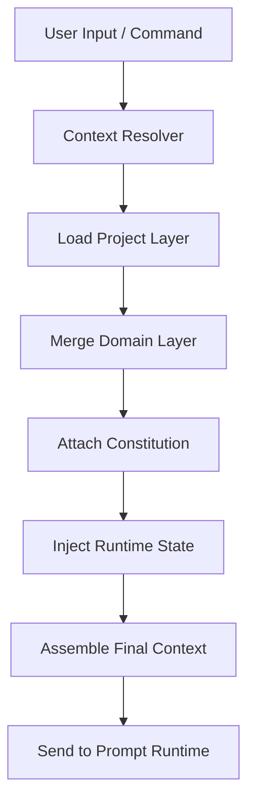

# 🧭 **SpecRails Context Orchestration & Layering Principle**

## 🎯 Цель

> Определить, как система SpecRails собирает, приоритизирует и управляет контекстом для AI-агентов, обеспечивая предсказуемое и согласованное поведение при генерации спецификаций, DSL и интерфейсов.

Контекст в SpecRails — это многослойная структура данных, формирующая «окружение» для AI.
Она обеспечивает, чтобы каждая операция — от анализа user story до построения формы — происходила в правильных рамках: проект, домен, пользователь, история и знания.

---

## 🧩 1. Роль Context Orchestration Layer

| Компонент                | Назначение                                                               |
| ------------------------ | ------------------------------------------------------------------------ |
| **Context Orchestrator** | Управляет сборкой и приоритетом контекстов для вызовов AI                |
| **Context Layers**       | Логические уровни данных (project, domain, user, runtime, memory)        |
| **Context Resolver**     | Определяет, какие источники должны быть объединены для конкретной задачи |
| **Context Normalizer**   | Приводит контекст к единому формату перед передачей AI                   |
| **Layer Policy Manager** | Определяет правила приоритизации и наследования контекста                |

---

## 🧱 2. Основные принципы контекстной архитектуры

| Принцип                       | Описание                                                                   |
| ----------------------------- | -------------------------------------------------------------------------- |
| **Layered Context**           | Контекст состоит из независимых, иерархически связанных слоёв              |
| **Deterministic Composition** | Каждый слой имеет строгие правила включения и приоритета                   |
| **Minimal Contamination**     | Данные одного слоя не должны непредсказуемо изменять другой                |
| **Context Traceability**      | Каждый результат AI содержит ссылку на контекст, из которого он был собран |
| **Fallback Isolation**        | При отсутствии слоя используется дефолт из Constitution или KB             |

---

## 🧩 3. Слои контекста

| Уровень       | Источник                   | Пример содержимого                             |
| ------------- | -------------------------- | ---------------------------------------------- |
| **System**    | Prompt Constitution        | Общие принципы, стиль, этика                   |
| **Domain**    | Knowledge Base             | Правила для UI, моделей, ACL, FSM              |
| **Project**   | Специфика проекта          | Терминология, локализация, структура сущностей |
| **User**      | Аналитик или архитектор    | Предпочтения, стиль, активная сессия           |
| **Runtime**   | Текущий процесс выполнения | История чата, ошибки, валидаторы               |
| **Ephemeral** | Одноразовые данные         | Текущий документ, форма, команда `/generate`   |

---

## ⚙️ 4. Механизм сборки контекста



---

## 🧠 5. Пример собранного контекста

```yaml
final_context:
  constitution: "prompt_constitution.v1"
  project:
    name: "Education Portal"
    entities: ["student", "teacher"]
  domain: "ui/forms"
  user:
    name: "Viktor"
    role: "analyst"
  runtime:
    document: "User and Board Data management-v15"
    history_ref: "#session_245"
  ephemeral:
    command: "/generate form for student registration"
```

---

## 🔁 6. Приоритизация слоёв

| Приоритет | Слой                      | Поведение при конфликте                                   |
| --------- | ------------------------- | --------------------------------------------------------- |
| 1️⃣       | **Ephemeral**             | Всегда перекрывает остальные слои (активная команда)      |
| 2️⃣       | **Runtime**               | Имеет приоритет при генерации последовательных артефактов |
| 3️⃣       | **User**                  | Может переопределять дефолты, но не системные принципы    |
| 4️⃣       | **Project**               | Применяется для ограничений и контекста домена            |
| 5️⃣       | **Domain**                | Дефолтные значения для области знания                     |
| 6️⃣       | **System (Constitution)** | Базовые принципы, не могут быть изменены                  |

---

## 🔍 7. Пример конфликта контекста

**Сценарий:**

* Constitution требует лаконичного вывода.
* User предпочитает детализированный стиль.
* Domain определяет, что поле должно быть обязательным.
* Project layer делает его опциональным.

**Решение:**

* Constitution имеет наивысший уровень непереопределяемости.
* Project layer побеждает Domain, так как имеет контекстную актуальность.
* User layer фиксируется как *предпочтение*, а не *обязательное правило*.

---

## 🧩 8. Layer Policy Manager

```yaml
layer_policy:
  immutable_layers: ["system", "constitution"]
  overridable_layers: ["project", "user", "runtime"]
  ephemeral_expiry: 1 session
  merge_strategy:
    project > domain
    runtime > project
    ephemeral > all
```

---

## 📊 9. Метрики качества контекста

| Метрика                     | Назначение                                           |
| --------------------------- | ---------------------------------------------------- |
| **Context Depth**           | Среднее количество активных слоёв при вызове AI      |
| **Merge Conflict Rate**     | Частота коллизий между слоями                        |
| **Resolution Latency**      | Среднее время сборки контекста                       |
| **Drift Sync Ratio**        | Доля слоёв, использующих устаревшие знания           |
| **Context Stability Index** | Насколько предсказуем результат при одинаковом вводе |

---

## 🧭 10. Архитектурный принцип

> **Контекст — это не данные, а состояние мышления системы.**
> Context Orchestration превращает разрозненные слои информации в согласованный когнитивный фрейм,
> где каждая генерация AI предсказуема, обоснована и воспроизводима.
