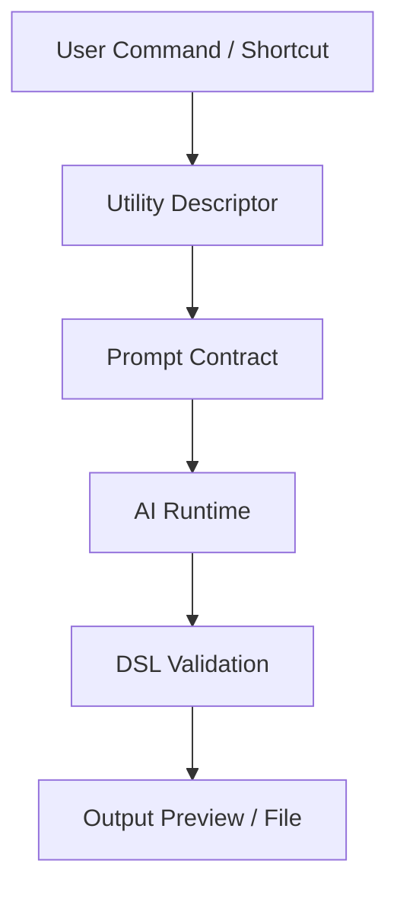
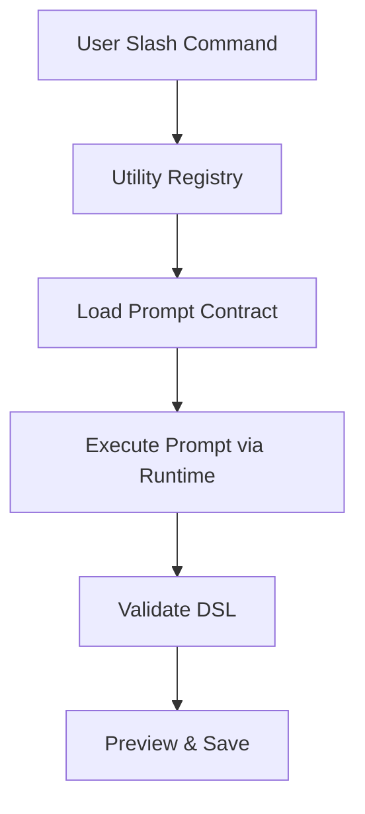

# 🧠 **SpecRails Developer Guide — Building AI Utilities**

## 🎯 Цель

> Данный документ описывает методологию и практические принципы создания AI-утилит, модулей и расширений на основе SpecRails SDK.
> Он служит мостом между архитектурными принципами и прикладной реализацией — для разработчиков, создающих расширяемые инструменты внутри SpecRails экосистемы.

---

## 🧩 1. Основная философия

AI-утилиты в SpecRails — это **мини-программы**, которые выполняют ограниченные, но воспроизводимые задачи с использованием AI.
Они не являются интерфейсом к модели напрямую, а работают через **Prompt Contracts**, **Core API** и **Context Layer**, сохраняя согласованность и управляемость.

### Принципы проектирования:

| Принцип                 | Описание                                                 |
| ----------------------- | -------------------------------------------------------- |
| **1. Минимализм**       | Каждая утилита решает одну задачу — без побочных функций |
| **2. Контролируемость** | Все обращения к AI идут через ядро и контракт            |
| **3. Комбинаторность**  | Утилиты можно объединять в пайплайны и сценарии          |
| **4. Расширяемость**    | Новые утилиты добавляются без изменения ядра             |
| **5. Предсказуемость**  | Одинаковый ввод должен давать идентичный результат       |

---

## ⚙️ 2. Архитектурная модель AI-утилиты



| Компонент                               | Назначение                                         |
| --------------------------------------- | -------------------------------------------------- |
| **Utility Descriptor (`utility.json`)** | Метаописание: имя, цель, используемые контракты    |
| **Prompt Contract**                     | Определяет контекст, структуру и формат AI-запроса |
| **Runtime Adapter**                     | Интерфейс связи с AI Execution Layer               |
| **DSL Validator**                       | Проверяет корректность результата                  |
| **Preview Adapter**                     | Отображает результат (форма, модель, схема)        |

---

## 🧱 3. Структура AI-утилиты

```
/specrails-utilities/
  ├── forms/
  │   ├── utility.json
  │   ├── form.prompt.yaml
  │   ├── runtime.js
  │   ├── validator.js
  │   └── preview.vue
  ├── models/
  │   ├── utility.json
  │   ├── model.prompt.yaml
  │   ├── runtime.js
  │   └── validator.js
  └── roles/
      ├── utility.json
      ├── acl.prompt.yaml
      └── validator.js
```

---

## 📦 4. Пример `utility.json`

```json
{
  "name": "form.builder",
  "title": "Form Builder Utility",
  "description": "Создает спецификацию формы из текстового описания",
  "promptContract": "contracts/form.contract.v2",
  "outputType": "form.dsl",
  "entry": "runtime.js",
  "preview": "preview.vue"
}
```

---

## 💬 5. Пример Prompt Contract (YAML)

```yaml
contract: form.contract.v2
type: generation
input:
  - name: description
    type: text
    required: true
  - name: domain
    type: string
    default: "ui/form"
output:
  format: yaml
  schema: "schemas/form.dsl.schema.json"
validation:
  enabled: true
  auto_fix: true
```

---

## 🧠 6. Runtime Adapter (пример на JS)

```js
import { executePrompt } from '@specrails/core'

export async function run(input) {
  const { description, domain } = input
  const result = await executePrompt({
    contract: 'form.contract.v2',
    context: { domain },
    input: description
  })
  return result.dsl
}
```

---

## 🧩 7. DSL Validator (пример)

```js
import Ajv from 'ajv'
import schema from './schemas/form.dsl.schema.json'

export function validate(dsl) {
  const ajv = new Ajv()
  const validate = ajv.compile(schema)
  const valid = validate(dsl)
  if (!valid) throw new Error('Invalid DSL: ' + JSON.stringify(validate.errors))
  return true
}
```

---

## 🧱 8. Preview Adapter (пример на Vue)

```vue
<template>
  <div>
    <h3>{{ form.title }}</h3>
    <form>
      <div v-for="field in form.fields" :key="field.name">
        <label>{{ field.label }}</label>
        <input :type="field.type" />
      </div>
    </form>
  </div>
</template>

<script setup>
import { ref } from 'vue'
const props = defineProps({ form: Object })
const form = ref(props.form)
</script>
```

---

## 🔗 9. Регистрация утилиты

Каждая утилита регистрируется в `specrails.config.json`:

```json
{
  "utilities": [
    "./specrails-utilities/forms",
    "./specrails-utilities/models",
    "./specrails-utilities/roles"
  ]
}
```

При старте SpecRails, Runtime автоматически:

* Загружает все дескрипторы `utility.json`.
* Проверяет корректность контрактов.
* Создаёт точки вызова (команды `/generate form`, `/compose model`).

---

## 🧩 10. Логика вызова утилит



---

## 🧭 11. Архитектурный принцип

> **AI-утилита — это не интеллект, а интерфейс к структуре знаний.**
> Она не «думает», а выполняет инженерный акт — интерпретирует текст, следуя контракту.
> В SpecRails AI используется как инструмент точного мышления, а не свободной генерации.
