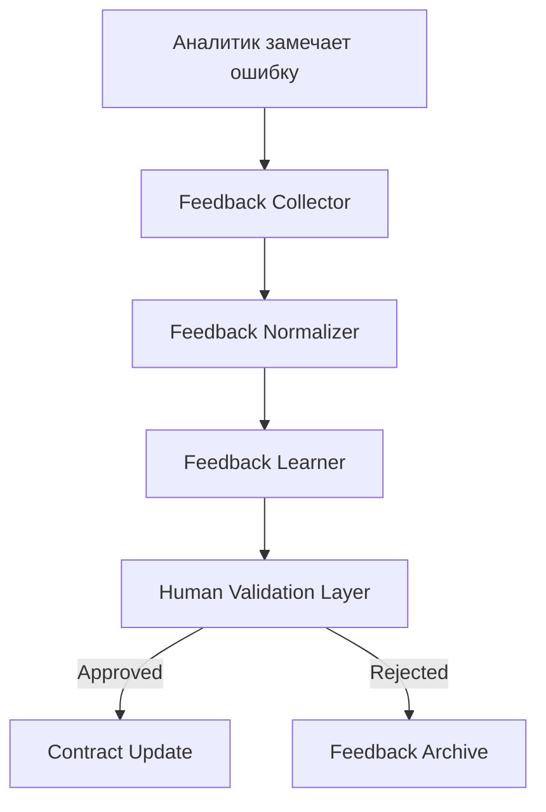

# 🧠 **SpecRails Human Feedback & Learning Loop**

## 🎯 Цель

> Определить, как система SpecRails использует человеческий фидбэк (аналитиков, архитекторов и пользователей) для постепенного улучшения поведения AI, Prompt Contracts и DSL без ручной настройки промтов.

---

## 🧩 1. Роль слоя Human Feedback

Человеческая обратная связь — это не просто комментарий, а структурированный сигнал, который становится частью обучающего цикла SpecRails.
Этот слой превращает опыт аналитика в **самообучающийся процесс корректировки AI и контрактов**, сохраняя при этом контроль и прозрачность.

| Компонент                    | Назначение                                                                  |
| ---------------------------- | --------------------------------------------------------------------------- |
| **Feedback Collector**       | Сохраняет замечания пользователей (в текстовой или структурированной форме) |
| **Feedback Normalizer**      | Преобразует замечания в формализованные данные (ошибки, улучшения, примеры) |
| **Feedback Learner**         | Генерирует предложения по улучшению контрактов и промтов                    |
| **Human Validation Layer**   | Проверяет корректность автосгенерированных предложений перед применением    |
| **Learning History Tracker** | Хранит все случаи, когда фидбэк изменил поведение системы                   |

---

## 🔁 2. Общий цикл работы



---

## 🧠 3. Типы обратной связи

| Тип фидбэка       | Источник       | Пример                                   | Реакция системы                              |
| ----------------- | -------------- | ---------------------------------------- | -------------------------------------------- |
| **Семантический** | Аналитик       | «Поле `age` не должно быть обязательным» | AI обновляет правила `required` в контракте  |
| **Форматный**     | Core Validator | Неверная структура YAML                  | Learner обновляет schema в контракте         |
| **Контекстный**   | Архитектор     | «Это поле не подходит для роли Teacher»  | Обновление ACL/Role контрактов               |
| **Визуальный**    | Пользователь   | «Эта кнопка не нужна»                    | Перегенерация UI-контракта с флагом `hidden` |

---

## 🧩 4. Формат хранения фидбэка

```yaml
feedback_entry:
  id: fbk-2025-1106-0012
  contract_id: "form.contract.v2"
  ai_model: "gpt-5"
  feedback_type: "semantic"
  source: "analyst"
  issue: "field 'email' should not be required"
  suggested_fix: "update required=false for field 'email'"
  action_taken: "applied"
  validated_by: "senior_analyst"
  timestamp: "2025-11-06T21:40:00Z"
```

---

## 🧱 5. Feedback → Learning Pipeline

1. **Сбор:** аналитик помечает проблему в preview или документе (shortcut `/feedback`).
2. **Нормализация:** AI классифицирует фидбэк по типу ошибки и важности.
3. **Предложение:** Learner формирует возможное исправление контракта или шаблона.
4. **Подтверждение:** человек подтверждает или редактирует предложение.
5. **Применение:** изменения публикуются в Prompt Registry как `patch` или `minor update`.

---

## ⚙️ 6. Типы автоматических реакций

| Уровень      | Автоматическая реакция             | Пример                           |
| ------------ | ---------------------------------- | -------------------------------- |
| **Low**      | Фиксация ошибки без изменений      | Несовпадение схемы               |
| **Medium**   | AI предлагает исправление          | Отсутствует обязательное поле    |
| **High**     | Автоприменение после подтверждения | Некритичная корректировка промта |
| **Critical** | Требует ручного пересмотра         | Логическая или бизнес-ошибка     |

---

## 🧩 7. Learning History Tracker

Система хранит все исправления и результаты, чтобы понимать, **что улучшилось и почему**.

```yaml
learning_record:
  feedback_id: fbk-2025-1106-0012
  contract_affected: "form.contract.v2"
  change_type: "schema_patch"
  before: "required: true"
  after: "required: false"
  result: "improved validation accuracy +12%"
```

---

## 🧠 8. Метрики эффективности обучения

| Метрика                           | Описание                                                           |
| --------------------------------- | ------------------------------------------------------------------ |
| **Feedback Utilization Rate**     | % фидбэков, которые привели к изменениям                           |
| **Contract Improvement Velocity** | Время между фидбэком и внедрением патча                            |
| **Human Review Ratio**            | Доля фидбэков, требующих ручной проверки                           |
| **Regression Rate**               | Количество откатов после неудачных автоправок                      |
| **Learning Gain Index**           | Среднее улучшение точности валидации DSL после применения фидбэков |

---

## 🔍 9. Интеграция с Observability и Registry

* Каждый фидбэк связывается с конкретным контрактом и версией.
* Registry автоматически создаёт новую версию, если изменения приняты.
* Drift Control отслеживает, не вызывает ли автоправка деградацию стабильности.
* Observability Dashboard визуализирует влияние фидбэков на качество.

---

## 🧭 10. Архитектурный принцип

> **Человеческий фидбэк — это не ошибка, а сигнал обучения.**
> SpecRails должен использовать опыт аналитиков как топливо для эволюции своих контрактов и поведения AI,
> при этом сохраняя управляемость, прозрачность и ответственность.
