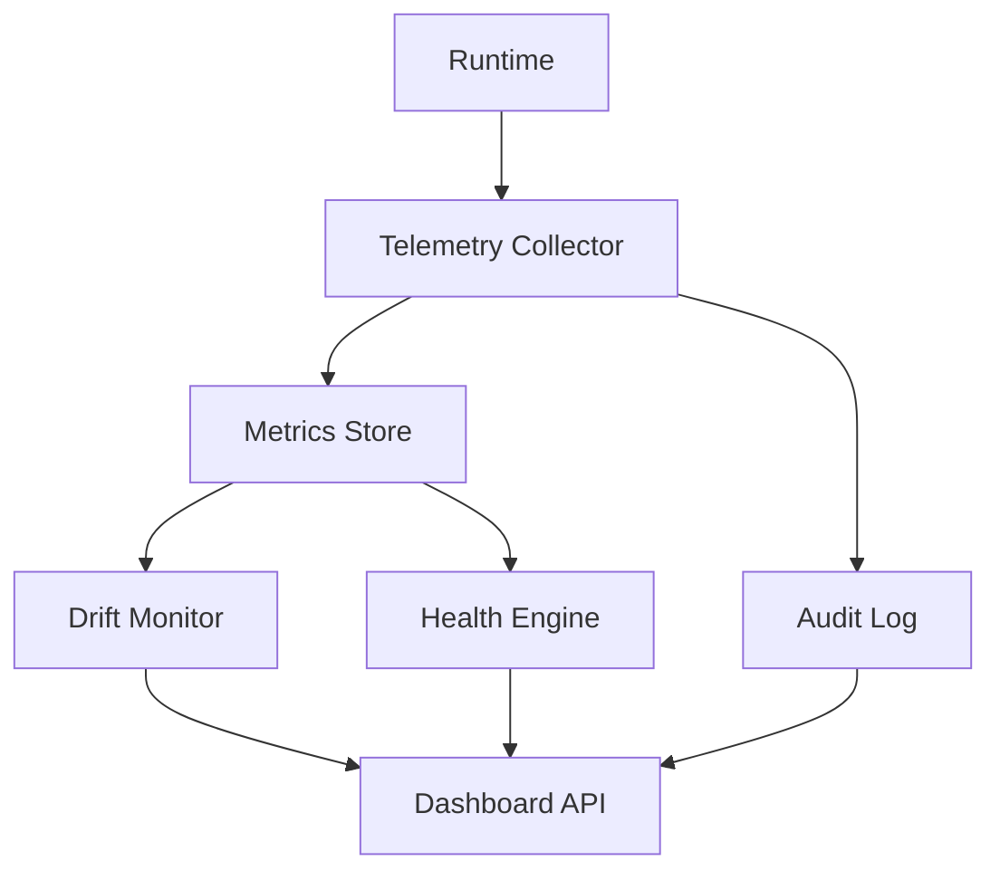

# 📈 **SpecRails Observability & Telemetry Layer**

## 🎯 Цель

> Определить систему наблюдаемости (observability) и телеметрии (telemetry) в SpecRails, обеспечивающую полную прозрачность выполнения AI-процессов, поведения модулей, стабильности DSL и надёжности всего runtime.

Observability Layer — это **сенсорная система SpecRails**, фиксирующая метрики, логи, дрейф поведения, ошибки и активность AI-агентов.
Она делает AI-процессы **измеримыми, воспроизводимыми и объяснимыми.**

---

## 🧩 1. Архитектурная роль

| Компонент               | Назначение                                                 |
| ----------------------- | ---------------------------------------------------------- |
| **Telemetry Collector** | Сбор метрик, событий и runtime-логов                       |
| **Drift Monitor**       | Контроль стабильности AI-результатов между итерациями      |
| **Health Engine**       | Мониторинг состояния модулей и sandbox                     |
| **Audit Trail**         | Отслеживание действий пользователей и изменений в DSL      |
| **Dashboard API**       | Визуализация показателей в интерфейсе или внешних системах |

---

## ⚙️ 2. Общая архитектура



Telemetry и Observability работают как **асинхронная шина событий**, не влияя на производительность ядра.

---

## 🧱 3. Типы собираемых данных

| Категория                 | Примеры метрик                                         |
| ------------------------- | ------------------------------------------------------ |
| **AI Behavior Metrics**   | drift_score, token_usage, response_latency, error_rate |
| **DSL Quality Metrics**   | validation_pass_rate, schema_error_density             |
| **Runtime Health**        | sandbox_violations, memory_usage, timeout_rate         |
| **Governance Compliance** | review_compliance, blocked_deploys                     |
| **User Actions**          | spec_edits, prompt_invocations, approvals_made         |

---

## 📊 4. Пример Telemetry Payload

```json
{
  "timestamp": "2025-11-06T22:50:00Z",
  "module": "form.builder",
  "event": "dsl_generated",
  "metrics": {
    "drift_score": 0.012,
    "tokens_used": 1584,
    "validation": "passed",
    "latency_ms": 842
  },
  "context": {
    "contract": "form.contract.v2",
    "user": "analyst_viktor",
    "session": "S-2025-11-06-09"
  }
}
```

---

## 🧠 5. Drift Monitoring

Drift Monitor анализирует AI-ответы и вычисляет индекс стабильности поведения моделей.

```yaml
drift_analysis:
  contract: "form.contract.v2"
  baseline_ref: "v0.1"
  current_score: 0.023
  threshold: 0.05
  status: "stable"
```

Если `current_score > threshold`, создаётся предупреждение и инициируется review:

```yaml
drift_alert:
  id: "DRIFT-2025-11-06-09"
  action: "flag for audit"
  severity: "medium"
```

---

## 🔍 6. Health Monitoring

Health Engine следит за жизненным циклом модулей и sandbox:

| Показатель             | Критерий                      |
| ---------------------- | ----------------------------- |
| **CPU Usage**          | < 80% во время исполнения     |
| **Memory Footprint**   | < 128 MB на модуль            |
| **Timeout Rate**       | < 2% операций превышают лимит |
| **Sandbox Violations** | 0 допускается для production  |

Пример health snapshot:

```yaml
health_status:
  module: "form.builder"
  uptime: "36h"
  memory_mb: 92
  cpu_load: 47%
  sandbox_violations: 0
  status: "healthy"
```

---

## 🔐 7. Audit Trail

Audit Trail фиксирует каждое изменение в спецификациях и контрактах.

```yaml
audit_event:
  id: "AUD-2025-11-06-07"
  user: "analyst_viktor"
  action: "edit spec"
  file: "model.student.v1.yaml"
  validation: "passed"
  checksum: "b23d4ac..."
  timestamp: "2025-11-06T22:55:00Z"
```

Audit логи хранятся в защищённом каталоге `.specrails/audit/` и доступны только пользователям с ролью `governance.admin`.

---

## ⚙️ 8. Dashboard API

Dashboard API обеспечивает визуализацию данных в виде графиков и отчётов.

Пример REST-запроса:

```bash
GET /api/telemetry/metrics?scope=team&metric=drift_score&interval=24h
```

Ответ:

```json
{
  "avg_drift": 0.024,
  "trend": "stable",
  "alerts": 2
}
```

---

## 📊 9. Интеграция с внешними системами

| Система              | Цель интеграции                             |
| -------------------- | ------------------------------------------- |
| **Grafana / Kibana** | визуализация метрик и логов                 |
| **Prometheus**       | хранение метрик и алертинг                  |
| **Elastic Stack**    | анализ логов и событий                      |
| **Slack / Teams**    | уведомления о критических инцидентах        |
| **SpecRails Cloud**  | централизованный мониторинг enterprise-сред |

---

## 🧱 10. Политика хранения и ретенции данных

```yaml
data_retention:
  telemetry_days: 30
  audit_days: 90
  health_history_days: 14
  anonymize_user_data: true
  storage_backend: "s3-compatible"
```

---

## 🧠 11. Метрики наблюдаемости

| Метрика                    | Описание                            |
| -------------------------- | ----------------------------------- |
| **Drift Stability Index**  | Средний дрейф AI-ответов            |
| **Validation Pass Rate**   | Успешность проверки DSL             |
| **Sandbox Violation Rate** | Нарушения политики изоляции         |
| **Governance Compliance**  | Соответствие политике ревью         |
| **Telemetry Coverage**     | Процент инструментированных модулей |

---

## 🧭 12. Архитектурный принцип

> **Наблюдаемость — это не мониторинг, а доверие в действии.**
> В SpecRails Observability не просто измеряет, а подтверждает корректность инженерных решений,
> превращая систему в самопроверяющуюся среду, где данные — главный аргумент, а не гипотеза.
