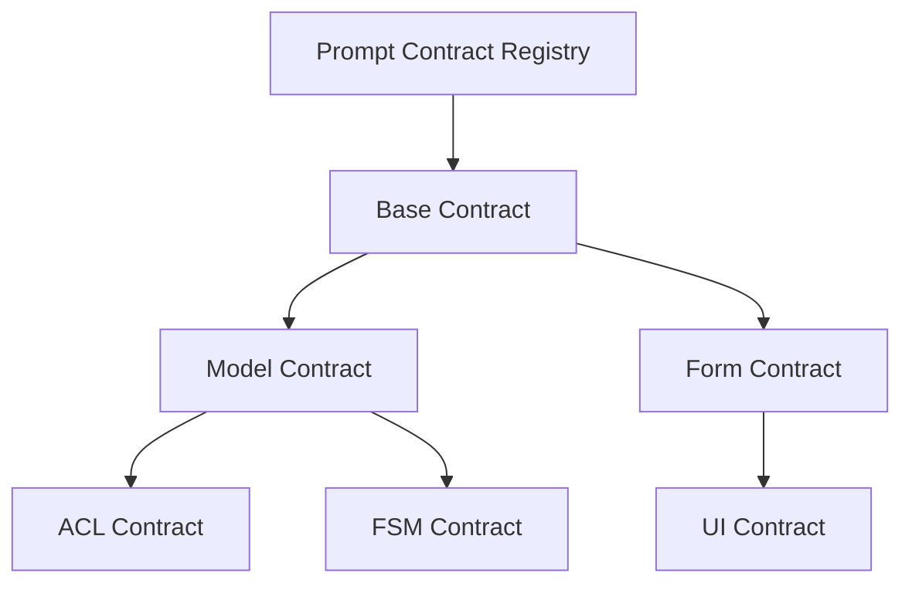

# 🧩 **SpecRails Prompt Modularity Principle**

## 🎯 Цель

> Обеспечить модульность, переиспользуемость и управляемость Prompt Contracts в системе SpecRails.
> Каждый контракт должен быть самостоятельным модулем поведения AI, с чётко определёнными границами, зависимостями и версиями.

---

## ⚙️ 1. Основные принципы модульности

| Принцип                   | Смысл                                                                               | Аналог в коде        |
| ------------------------- | ----------------------------------------------------------------------------------- | -------------------- |
| **Single Responsibility** | Контракт решает одну задачу: форма, модель, ACL и т.д.                              | Класс / модуль       |
| **Explicit Interface**    | Входы и выходы заданы явно (`input`, `output`, `context`)                           | API-интерфейс        |
| **Loose Coupling**        | Контракты связаны только через публичные контексты, а не внутренние структуры       | Dependency Injection |
| **Composable Design**     | Контракты можно объединять в цепочки (form → model → ACL)                           | Pipeline             |
| **Version Isolation**     | Новые версии не ломают старые; совместимость обеспечивается через schema references | Semantic Versioning  |

---

## 🧱 2. Архитектура модульных контрактов



* Все контракты регистрируются в **Prompt Contract Registry**.
* Каждый контракт может **наследовать (extends)** базовые принципы, **импортировать (imports)** другие и **композировать (compose)** цепочки поведения.

---

## 🧩 3. Пример модульного контракта

```yaml
# form.generator.yaml
extends: "base.prompt.contract"
imports:
  - "model.contract.v1"
  - "acl.contract.v1"
context:
  entity: "student_profile"
input:
  description: "Create a user-facing form based on model and ACL rules"
output:
  format: "yaml"
  schema: "spec.form.v1.json"
```

Контракт **не содержит всю логику генерации формы** — он лишь импортирует необходимые контексты и определяет собственную задачу.

---

## ⚙️ 4. Механизмы модульности

| Механизм                | Что делает                                               | Аналог                 |
| ----------------------- | -------------------------------------------------------- | ---------------------- |
| **extends**             | Наследует общие правила и структуру промта               | классовое наследование |
| **imports**             | Подключает внешние контракты (модель, ACL, FSM)          | include / import       |
| **compose**             | Объединяет несколько контрактов в единый pipeline        | middleware             |
| **override**            | Переопределяет часть поведения или контекста             | override method        |
| **context inheritance** | Делает общие параметры (язык, схема) доступными потомкам | DI контейнер           |

---

## 🧠 5. Пример композиции

```yaml
compose:
  - use: "model.contract.v1"
  - use: "acl.contract.v1"
  - use: "fsm.contract.v1"
steps:
  - task: "generate model"
  - task: "generate acl"
  - task: "generate fsm"
  - task: "generate form using results of previous steps"
```

Контракты работают как **pipeline** — AI проходит шаги поочерёдно, а SpecRails Core гарантирует совместимость схем.

---

## 🧩 6. Технические правила модульности

1. Каждый контракт имеет **уникальный ID и версию**.
2. Связи описываются только через **registry**, без прямых зависимостей.
3. Контракты определяют **input/output** явно и декларативно.
4. Контракты не зависят от конкретной модели AI — только от интерфейса SpecRails.
5. Каждый контракт **валидируется ядром** (через JSON Schema).

---

## 🧭 7. Зачем нужна модульность

* 🔁 **Переиспользуемость** — один контракт можно применять в разных проектах.
* ⚙️ **Совместимость** — независимое обновление модулей.
* 🧩 **Поддерживаемость** — локальные изменения не ломают систему.
* 📊 **Тестируемость** — можно проверять каждый контракт отдельно.
* 🧠 **Расширяемость** — разработчики могут создавать свои Prompt SDK.

---

## 💡 8. Архитектурный принцип

> **Prompt Contract = модуль поведения AI.**
> Модульность делает систему устойчивой, управляемой и воспроизводимой.
> Контракты должны оставаться мелкозернистыми, версионируемыми и взаимозаменяемыми — как пакеты в экосистеме NPM или классы в кодовой базе.
