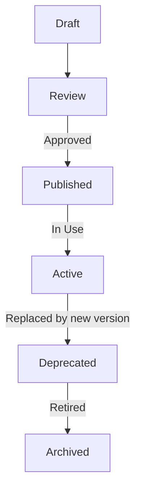

# 🧭 **SpecRails Prompt Registry & Lifecycle**

## 🎯 Цель

> Определить архитектуру, процессы и правила управления жизненным циклом Prompt Contracts — от создания до снятия с эксплуатации.
> Prompt Registry — это системное хранилище контрактов, обеспечивающее их версионирование, совместимость и контроль качества.

---

## ⚙️ 1. Архитектурная роль

| Компонент                      | Назначение                                                              |
| ------------------------------ | ----------------------------------------------------------------------- |
| **Prompt Registry**            | Централизованное хранилище всех контрактов, их версий и связей          |
| **Contract Lifecycle Manager** | Управляет публикацией, обновлением, архивированием и отзывом контрактов |
| **Compatibility Engine**       | Проверяет совместимость между версиями и зависимостями контрактов       |
| **Audit Trail**                | Фиксирует историю использования контрактов при генерации артефактов     |

---

## 🧩 2. Жизненный цикл контракта



| Стадия         | Описание                                                 | Ответственный   |
| -------------- | -------------------------------------------------------- | --------------- |
| **Draft**      | Черновик контракта создаётся AI Governance или Core Team | Автор           |
| **Review**     | Проводится ручная и автоматическая проверка              | Архитектор / QA |
| **Published**  | Контракт добавляется в реестр, получает версию           | Governance Team |
| **Active**     | Контракт используется в генерации DSL                    | Runtime System  |
| **Deprecated** | Контракт устарел, но ещё поддерживается                  | Core System     |
| **Archived**   | Контракт снят с эксплуатации, хранится для трассировки   | Audit System    |

---

## 🧱 3. Пример структуры реестра

```yaml
registry:
  - id: base.contract.v1
    status: active
    file: "base.prompt.yaml"
    created_at: "2025-10-01"
    owner: "specrails-core"

  - id: form.contract.v2
    status: active
    extends: "base.contract.v1"
    depends_on: ["model.contract.v1", "acl.contract.v1"]
    schema: "spec.form.v1.json"

  - id: model.contract.v1
    status: deprecated
    replaced_by: "model.contract.v2"
```

---

## 🔄 4. Операции с контрактами

| Операция      | Описание                                    | Триггер             |
| ------------- | ------------------------------------------- | ------------------- |
| **publish**   | Публикация контракта в реестр               | После ревью         |
| **update**    | Обновление версии без смены идентификатора  | Minor release       |
| **replace**   | Замена контракта новым с изменённым schema  | Major release       |
| **deprecate** | Перевод в устаревшее состояние              | При несовместимости |
| **archive**   | Снятие с эксплуатации и перемещение в архив | Автоматически       |

---

## ⚙️ 5. Совместимость и проверка зависимостей

Compatibility Engine проверяет:

* наличие зависимостей (`depends_on`),
* корректность схем (`schema_ref`),
* согласованность контекста (`domain`, `type`, `format`),
* поддерживаемые версии AI агентов.

```yaml
compatibility:
  requires: ["base.contract.v1"]
  supports_ai_models: ["gpt-5", "claude-3"]
  schema_ref: "spec.form.v1.json"
```

---

## 🧠 6. Версионирование

| Тип обновления | Пример            | Правило                                            |
| -------------- | ----------------- | -------------------------------------------------- |
| **Major**      | `v1 → v2`         | Изменена структура, несовместимо с прошлой схемой  |
| **Minor**      | `v1.0 → v1.1`     | Добавлены необязательные поля или уточнены правила |
| **Patch**      | `v1.1.0 → v1.1.1` | Исправления без изменения логики                   |

Все версии хранятся и могут быть восстановлены через `rollback`.

---

## 📊 7. Audit Trail и трассировка

Каждая генерация AI фиксируется с указанием версии контракта:

```yaml
audit_entry:
  timestamp: "2025-11-06T09:42:00Z"
  contract_used: "form.contract.v2"
  ai_model: "gpt-5"
  result_hash: "0x8ffbc1a"
  validation: "passed"
```

Это позволяет восстановить цепочку: *Prompt → Output → Validation → Feedback → Correction*.

---

## 🧩 8. Интеграция с ядром SpecRails

* Registry подключается как **внешний сервис ядра**, но может работать в оффлайн-режиме (локальный кеш).
* Все запросы к AI проходят через **Prompt Lifecycle Manager**, который определяет актуальную версию контракта.
* Deprecated контракты не удаляются автоматически — их можно закрепить (freeze) для стабильных релизов.

---

## 🧭 9. Архитектурный принцип

> **Prompt Registry — это операционная система для контрактов.**
> Он обеспечивает воспроизводимость, управляемость и контроль качества общения AI и ядра SpecRails.

Контракты не просто файлы, а **версии соглашений между человеком, AI и машинной логикой**, и реестр гарантирует, что эти соглашения можно воспроизвести, проверить и развивать без хаоса.
