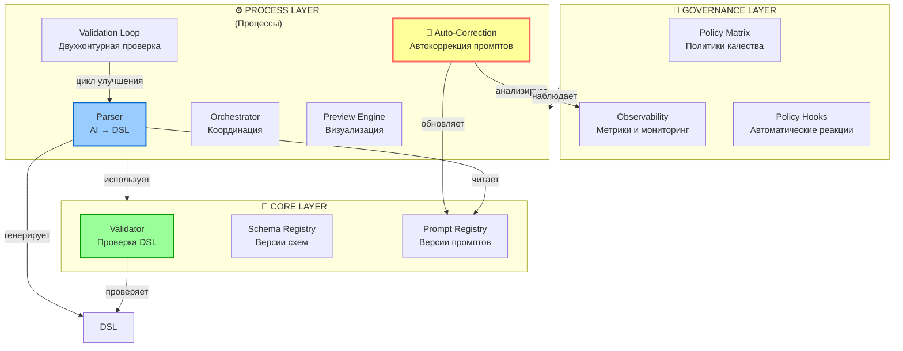
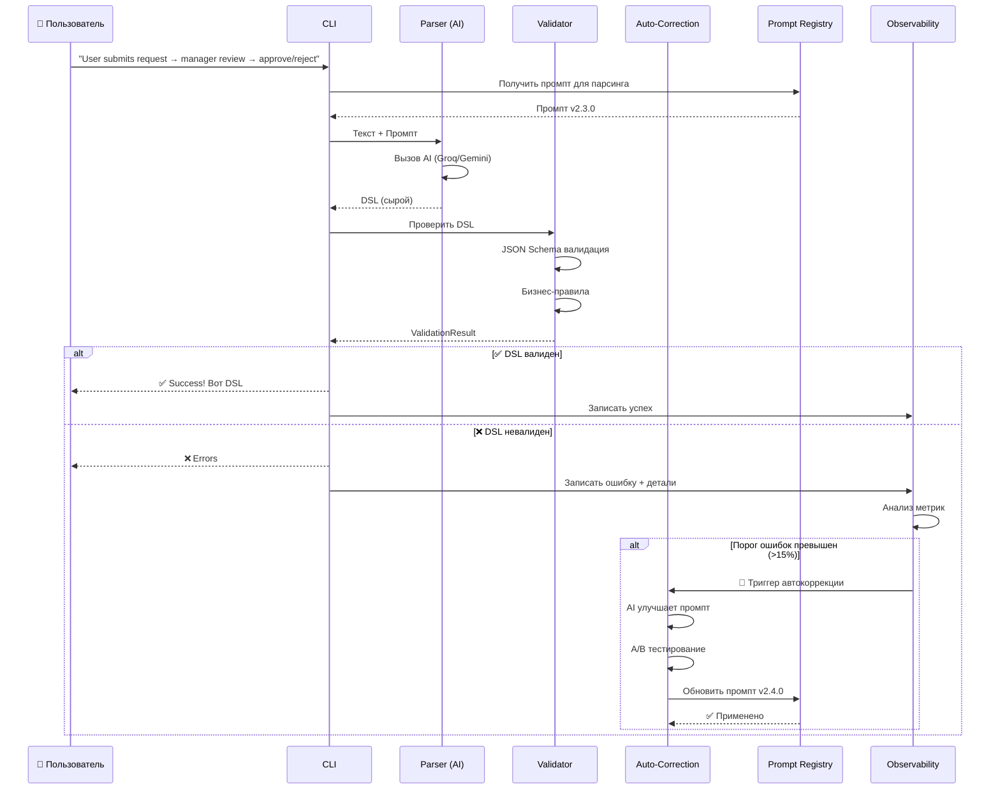
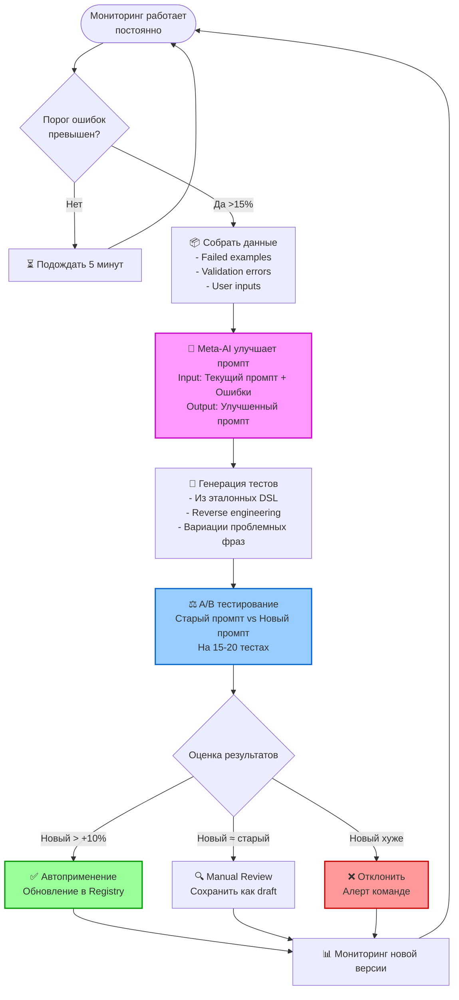
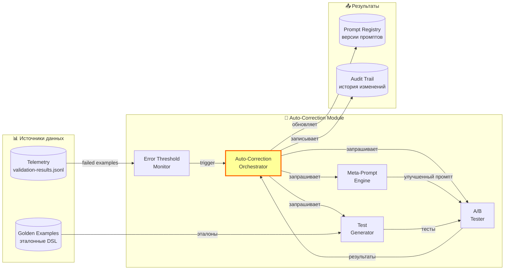
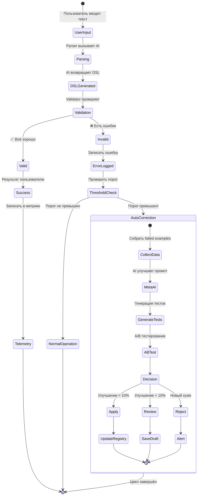
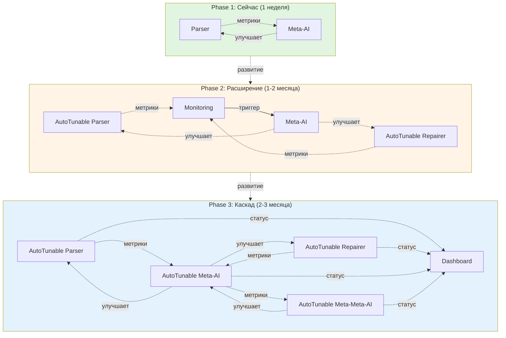

# Обзор архитектуры системы SpecRails

**Дата:** 2026-02-11  
**Статус:** Актуальная архитектура  
**Аудитория:** Для понимания общей картины системы

---

## 🎯 Что такое SpecRails в двух словах

**SpecRails** — система превращения текстовых описаний в структурированные спецификации (DSL) с помощью AI.

**Главная идея:** Превратить AI из "волшебного черного ящика" в инженерный инструмент с чёткими контрактами и проверяемыми результатами.

**Ключевая фича:** Система **сама улучшает свои промпты** на основе анализа ошибок через автокоррекцию.

---

## 🏗️ Три уровня архитектуры



---

## 📋 Описание каждого уровня

### 🧱 Core Layer (Ядро) — Детерминированная работа

**Принцип:** Никакого AI, только чистая логика

| Компонент | Ответственность | Что делает |
|-----------|----------------|-----------|
| **Validator** | Проверка DSL | Проверяет структуру, типы, бизнес-правила. НЕ исправляет, только находит ошибки |
| **Schema Registry** | Управление схемами | Хранит JSON Schema для всех версий DSL |
| **Prompt Registry** | Управление промптами | Хранит версии промптов для AI с метаданными |

**Важно:** Ядро всегда даёт одинаковый результат для одинакового входа (детерминизм).

---

### ⚙️ Process Layer (Процессы) — Координация AI и валидации

**Принцип:** Управляет жизненным циклом генерации DSL

| Компонент | Ответственность | Что делает |
|-----------|----------------|-----------|
| **Parser** | AI → DSL | **Единственная точка** работы с AI. Превращает текст в структурированный DSL |
| **Orchestrator** | Координация | Управляет последовательностью: парсинг → валидация → предпросмотр → обратная связь |
| **Validation Loop** | Двухконтурная проверка | 1) Машинная валидация (Validator) 2) Человеческая валидация (через Preview) |
| **Preview Engine** | Визуализация | Показывает DSL аналитику в понятном виде для проверки |
| **🔄 Auto-Correction** | Автоулучшение промптов | **Автоматически улучшает промпты** на основе анализа ошибок |

**Важно:** Process Layer — это "мозг" системы, который координирует всё.

---

### 🎯 Governance Layer (Управление) — Метрики и политики

**Принцип:** Наблюдает за системой и поддерживает качество

| Компонент | Ответственность | Что делает |
|-----------|----------------|-----------|
| **Policy Matrix** | Политики качества | Определяет критерии: что считается "хорошим" DSL, какие метрики важны |
| **Observability Framework** | Сбор метрик | Собирает данные: успешность валидаций, время генерации, частота ошибок |
| **Policy Hooks** | Автоматические реакции | Реагирует на отклонения: алерты, откаты, блокировка плохих промптов |

**Важно:** Governance НЕ вмешивается в процессы, только наблюдает и реагирует на проблемы.

---

## 🔄 Основной flow работы системы



---

## 🔄 Подробная схема Auto-Correction (Автокоррекция промптов)

**Место в архитектуре:** Process Layer  
**Триггер:** Порог ошибок превышен (например, >15% за последний час)



---

## 🧩 Компоненты Auto-Correction в деталях



---

## 📊 Как работает каждый компонент Auto-Correction

### 1. Error Threshold Monitor (Мониторинг порога ошибок)

**Что делает:**
- Отслеживает метрики каждые 5 минут
- Считает % неудачных валидаций за последний час
- Триггерит автокоррекцию при превышении порога

**Пример:**
```
Последний час:
- Всего запросов: 50
- Неудачных: 9
- Error rate: 18% (порог: 15%)
→ 🚨 Триггер автокоррекции!
```

---

### 2. Meta-Prompt Engine (AI улучшает AI)

**Что делает:**
- Берёт текущий промпт
- Берёт примеры ошибок
- Просит AI улучшить промпт для парсера
- Возвращает улучшенную версию + обоснование

**Метапромпт (упрощённо):**
```
Ты — эксперт по промптам для AI.

Вот текущий промпт для парсера процессов:
[промпт]

Вот примеры ошибок, которые он делает:
[примеры с ошибками]

Улучши промпт так, чтобы устранить эти ошибки.
Верни:
- Улучшенный промпт
- Обоснование изменений
- Уверенность (0-1)
```

---

### 3. Test Generator (Генератор тестов)

**Что делает:**
- **Reverse engineering:** Берёт эталонный DSL → генерирует текст
- Создаёт вариации проблемных фраз
- Формирует тестовый набор из 15-20 примеров

**Пример:**
```
DSL эталон:
{
  "entry": "start",
  "lanes": [{"id": "lane_1", "label": "User"}],
  "steps": [
    {"id": "start", "label": "Submit", "lane": "lane_1", "next": "review"},
    {"id": "review", "label": "Review", "lane": "lane_1", "next": "end"}
  ]
}

AI генерирует текст:
"User submits something, then it gets reviewed"
```

---

### 4. A/B Tester (Сравнение промптов)

**Что делает:**
- Запускает старый и новый промпт на одних тестах
- Сравнивает метрики:
  - Validation success rate
  - Field accuracy
  - Structural correctness
- Выбирает победителя

**Пример результата:**
```
Prompt A (текущий):  73% success
Prompt B (улучшенный): 93% success
→ Winner: B (+27% improvement)
→ Рекомендация: APPLY
```

---

### 5. Auto-Correction Orchestrator (Координатор)

**Что делает:**
- Координирует весь процесс
- Принимает решения:
  - Если улучшение > 10% → автоприменение
  - Если улучшение < 10% → manual review
  - Если хуже → отклонение + алерт

**Безопасность:**
- Максимум 1 автокоррекция в час
- Максимум 3 автокоррекции в день
- Автооткат при деградации

---

## 🎯 Где что находится в коде

```
process-core-proto/
├── packages/
│   ├── process-core/              # 🧱 CORE LAYER
│   │   └── src/
│   │       ├── validate.ts        # Validator
│   │       └── types.ts           # Схемы DSL
│   │
│   └── parser/                    # ⚙️ PROCESS LAYER
│       └── src/
│           ├── parser.ts          # Parser (AI → DSL)
│           │
│           ├── providers/         # AI провайдеры
│           │   ├── groq.ts
│           │   ├── gemini.ts
│           │   └── openai.ts
│           │
│           ├── contracts/
│           │   └── registry.ts    # Prompt Registry
│           │
│           └── 🔄 AUTO-CORRECTION (запланировано)
│               ├── monitoring/
│               │   └── error-threshold-monitor.ts
│               │
│               ├── meta/
│               │   └── meta-prompt-engine.ts
│               │
│               ├── testing/
│               │   ├── test-generator.ts
│               │   └── prompt-ab-tester.ts
│               │
│               └── orchestration/
│                   └── auto-correction-orchestrator.ts
│
├── .specrails/                    # 🎯 GOVERNANCE LAYER (данные)
│   ├── telemetry/
│   │   └── validation-results.jsonl
│   │
│   └── prompts/
│       └── process.v1.extract/
│           ├── v2.0.0.md
│           ├── v2.1.0.md
│           └── v2.2.0.md
│
└── src/
    └── cli.ts                     # CLI интерфейс
```

---

## 🔄 Полный жизненный цикл запроса



---

## 📊 Метрики и мониторинг

### Основные метрики системы

| Метрика | Где собирается | Для чего используется |
|---------|---------------|----------------------|
| **Validation Success Rate** | Observability Framework | Триггер автокоррекции |
| **Parser Accuracy** | Validator результаты | Качество AI генерации |
| **Auto-Correction Success** | Auto-Correction Orchestrator | Эффективность улучшений |
| **Prompt Version** | Prompt Registry | Отслеживание изменений |
| **Time to Correction** | Auto-Correction Orchestrator | Скорость реакции |

### Пороги для триггеров

```
Автокоррекция триггерится если:
- Error rate > 15% за последний час
- Минимум 10 запросов собрано
- Прошло > 1 час с последней автокоррекции

Автоприменение если:
- Улучшение > +10%
- Минимум 15 тестов пройдено
- Confidence AI > 0.8
```

---

## 🎯 Преимущества такой архитектуры

### 1. Разделение ответственности
- **Core** — детерминированная логика
- **Process** — координация AI
- **Governance** — наблюдение и контроль

### 2. Самоулучшение системы
- AI сам улучшает свои промпты
- Без участия человека (при высокой уверенности)
- Система учится на своих ошибках

### 3. Прозрачность и контроль
- Все изменения промптов логируются
- A/B тесты дают объективные метрики
- Можно откатиться к любой версии

### 4. Масштабируемость
- Один механизм автокоррекции для всех контрактов
- Легко добавить новые типы DSL
- Можно параллелить улучшения

---

## ⚠️ Важные принципы

### 1. Единственная точка AI
**Только Parser** работает с AI напрямую.  
Остальные компоненты детерминированные.

### 2. Валидация в два контура
1. **Машинная** — Validator (формальная проверка)
2. **Человеческая** — Preview + Analyst (смысловая проверка)

### 3. Безопасность автокоррекции
- Пороги для автоприменения
- Откат при деградации
- Audit trail всех изменений
- Rate limiting (max 3/день)

### 4. Observability First
Без метрик автокоррекция не работает.  
Observability Framework — критический компонент.

---

## 🚀 Статус реализации

| Компонент | Статус | Приоритет |
|-----------|--------|-----------|
| **Core Layer** | ✅ Реализовано | — |
| **Parser** | ✅ Реализовано | — |
| **Validator** | ✅ Реализовано | — |
| **Prompt Registry** | ✅ Базовая версия | — |
| **Observability** | 🚧 Частично | Средний |
| **Auto-Correction** | 📋 Запланировано | **Высокий** |
| └─ Error Monitor | ❌ Не начато | Высокий |
| └─ Meta-Prompt Engine | ❌ Не начато | Высокий |
| └─ Test Generator | ❌ Не начато | Высокий |
| └─ A/B Tester | ❌ Не начато | Средний |
| └─ Orchestrator | ❌ Не начато | Средний |

---

## 📚 Связанные документы

- **Core Layer:** [Core_Principle.md](Core_Principle.md)
- **Parser:** [Parser_Architecture.md](Parser_Architecture.md)
- **Validation:** [Validation_Loop_Principle.md](Validation_Loop_Principle.md)
- **Prompt Registry:** [Prompt_Registry_and_Runtime_Manifest.md](Prompt_Registry_and_Runtime_Manifest.md)
- **Observability:** [Observability_Framework.md](Observability_Framework.md)
- **Auto-Correction Plan:** [../notes/2026-02-11/plan-full-automation.md](../notes/2026-02-11/plan-full-automation.md)

---

## � Единый модуль для каскада автокоррекции

### Текущее состояние (Phase 1)

**Сейчас:** Один Meta-AI для улучшения промптов Parser/Repairer

```
Parser (генерация DSL)
   ↑
Meta-AI (улучшает промпт Parser)
   ↑
Human (настраивает Meta-AI)
```

### Будущее развитие (Phase 2-3)

**Цель:** Универсальный интерфейс для любых автокорректируемых компонентов

```typescript
/**
 * Единый интерфейс для автокорректируемых AI компонентов
 * 
 * Принципы:
 * - YAGNI: Реализуем только то, что используем
 * - KISS: Простой и понятный интерфейс
 * - DRY: Не дублируем логику автокоррекции
 */
interface AutoTunable<Input, Output> {
  // ========== Основная работа ==========
  
  /** Идентификатор компонента */
  id: string  // "parser", "repairer", "meta-ai"
  
  /** Что делает этот компонент */
  task: string  // "parse text to DSL", "repair invalid DSL"
  
  /** Текущая версия промпта */
  promptVersion: string  // "v2.3.0"
  
  /** Выполнить задачу */
  execute(input: Input): Promise<Output>
  
  // ========== Обратная связь ==========
  
  /** Проверить качество результата */
  validate(output: Output): ValidationResult
  
  /** Вычислить метрику качества (0-1) */
  getQualityMetric(): Promise<number>
  
  /** Собрать данные об ошибках */
  collectErrorData(): Promise<ErrorData>
  
  // ========== Автоулучшение (опционально) ==========
  
  /** Meta-AI для улучшения промпта (если есть) */
  metaImprover?: MetaImprover
  
  /** Улучшить промпт */
  autoImprove?(): Promise<ImprovementResult>
}

/**
 * Результат валидации (универсальный)
 */
interface ValidationResult {
  ok: boolean
  errors?: Array<{
    message: string
    path?: string
    severity: "error" | "warning"
  }>
}

/**
 * Данные об ошибках для анализа
 */
interface ErrorData {
  total: number
  errorRate: number
  patterns: Array<{
    pattern: string       // "Uses 'name' instead of 'label'"
    frequency: number     // Сколько раз встречается
    examples: any[]       // Примеры ошибок
  }>
}

/**
 * Результат автоулучшения
 */
interface ImprovementResult {
  success: boolean
  oldVersion: string
  newVersion: string
  improvement: number      // % улучшения
  appliedAutomatically: boolean
}
```

### Эволюция системы

#### Phase 1: Один Meta-AI (сейчас)

```
packages/parser/src/
├── meta/                    # 🆕 Meta-AI модуль
│   ├── meta-prompt-engine.ts
│   └── types.ts
│
└── repair/                  # Repairer (уже есть)
    └── repairer.ts
```

**Что реализуем:**
- Meta-AI для улучшения промпта Parser
- Базовый интерфейс `AutoTunable` (используем для Parser)
- Телеметрия для сбора ошибок

**Не реализуем:**
- Полный каскад
- Meta-Meta-AI
- Автоматический мониторинг

#### Phase 2: Расширение (1-2 месяца)

```
packages/parser/src/
├── auto-tuning/             # 🆕 Единый модуль автокоррекции
│   ├── auto-tunable.ts     # Базовый класс AutoTunable
│   ├── monitoring.ts       # Мониторинг метрик
│   ├── telemetry.ts        # Сбор данных
│   └── types.ts
│
├── meta/
│   └── meta-prompt-engine.ts  # Тоже AutoTunable!
│
├── parser.ts                # AutoTunable Parser
└── repair/
    └── repairer.ts          # AutoTunable Repairer
```

**Что реализуем:**
- Обёртка `AutoTunableComponent` для всех компонентов
- Автоматический мониторинг метрик
- Auto-improvement loop для Parser и Repairer

#### Phase 3: Каскад (2-3 месяца)

```
packages/parser/src/
├── auto-tuning/
│   ├── auto-tunable.ts
│   ├── cascade.ts           # 🆕 Управление каскадом
│   ├── monitoring.ts
│   └── dashboard.ts         # 🆕 Визуализация
│
└── meta/
    ├── meta-ai.ts           # Meta-AI (AutoTunable)
    └── meta-meta-ai.ts      # 🆕 Meta-Meta-AI (AutoTunable)
```

**Что реализуем:**
- Полный каскад автокоррекции
- Meta-Meta-AI для улучшения Meta-AI
- Dashboard для человека
- Audit trail

### Базовая реализация (Phase 1)

**Минимальный AutoTunable для Parser:**

```typescript
// packages/parser/src/auto-tuning/types.ts

/**
 * Базовый интерфейс (минимальный для Phase 1)
 */
export interface AutoTunable<Input, Output> {
  id: string
  task: string
  promptVersion: string
  
  execute(input: Input): Promise<Output>
  validate(output: Output): ValidationResult
  getQualityMetric(): Promise<number>
}

// Расширенная версия для будущего
export interface AutoTunableAdvanced<Input, Output> extends AutoTunable<Input, Output> {
  collectErrorData(): Promise<ErrorData>
  metaImprover?: MetaImprover
  autoImprove?(): Promise<ImprovementResult>
}
```

**Использование в Parser (Phase 1):**

```typescript
// packages/parser/src/parser.ts

export class Parser implements AutoTunable<string, DSL> {
  id = "parser"
  task = "parse text to DSL"
  promptVersion = "v2.0.0"  // Из Prompt Registry
  
  async execute(input: string): Promise<DSL> {
    // Существующая логика парсинга
    return await this.run({ userText: input, contractId: "process.v1.extract" })
  }
  
  validate(output: DSL): ValidationResult {
    return validateSpecV1(output, { forbidCycles: true })
  }
  
  async getQualityMetric(): Promise<number> {
    // Берём из телеметрии или вычисляем
    const recentResults = await telemetry.getRecent("parser", 100)
    const successCount = recentResults.filter(r => r.ok).length
    return successCount / recentResults.length
  }
}
```

### Преимущества подхода

**✅ YAGNI соблюдается:**
- Определяем только базовый интерфейс
- Используем его в Parser уже сейчас
- Не реализуем то, что не нужно сразу

**✅ KISS соблюдается:**
- Интерфейс простой и понятный
- 3 обязательных метода, остальное опционально
- Понятная эволюция от простого к сложному

**✅ DRY соблюдается:**
- Логика автокоррекции в одном месте
- Все компоненты используют один интерфейс
- Не дублируем телеметрию, валидацию, метрики

### Диаграмма эволюции



### План внедрения

**Week 1 (Phase 1):**
- [x] Определить интерфейс `AutoTunable`
- [ ] Реализовать базовый Meta-AI
- [ ] Добавить телеметрию в Parser
- [ ] Первое автоулучшение промпта

**Weeks 2-4:**
- [ ] Обернуть Parser в `AutoTunableComponent`
- [ ] Обернуть Repairer в `AutoTunableComponent`
- [ ] Добавить автоматический мониторинг

**Months 2-3 (Phase 2):**
- [ ] Реализовать `AutoTuningLoop`
- [ ] Мониторинг метрик каждый день
- [ ] Автоулучшение при превышении порога

**Months 3-6 (Phase 3):**
- [ ] Meta-AI как AutoTunable
- [ ] Meta-Meta-AI
- [ ] Полный каскад
- [ ] Dashboard для человека

### Критерии успеха

**Phase 1:**
- Meta-AI может улучшить промпт Parser
- Улучшение > 10% на тестовых данных

**Phase 2:**
- Parser и Repairer автоматически улучшаются
- Human intervention < 5% случаев

**Phase 3:**
- Полный каскад работает автономно
- Человек только одобряет критичные изменения
- Success rate > 95% для всех компонентов

---

## �💡 Следующие шаги

**Для реализации Auto-Correction:**

1. **Week 1-2:** Реализовать Error Threshold Monitor + базовый сбор метрик
2. **Week 3-4:** Реализовать Meta-Prompt Engine + Test Generator
3. **Week 5-6:** Реализовать A/B Tester + Auto-Correction Orchestrator
4. **Week 7-8:** Production-ready: безопасность, мониторинг, rollback

**Первый шаг:** Начать с Meta-Prompt Engine — самая интересная часть! 🚀
