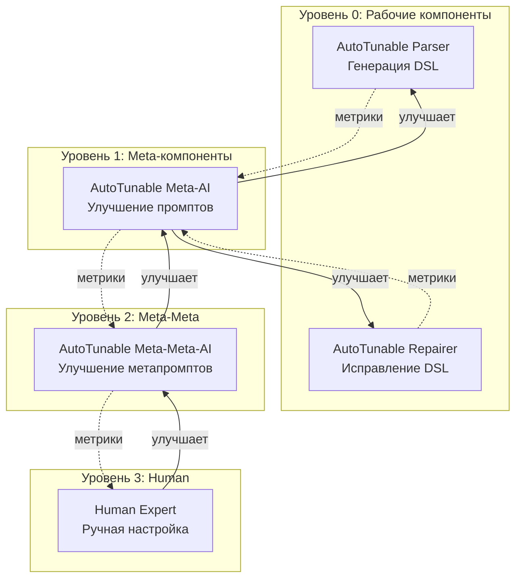

# Рекурсивная автокоррекция: Meta-Meta-AI и универсальный подход

**Дата:** 2026-02-11  
**Тема:** Философия автокоррекции промптов и метапромптов  
**Вопрос:** Можно ли создать единый модуль для автокоррекции произвольных AI компонентов?

---

## 🤔 Ключевые вопросы

### Вопрос 1: Почему автокоррекция промптов вообще возможна?

**Ответ: Да, потому что у нас есть детерминированная обратная связь**

#### Необходимые компоненты для автокоррекции:

```
1. ЭТАЛОН (Ground Truth)
   ├─ Golden Examples: правильные DSL
   └─ Expected behavior: что должно быть

2. ИЗМЕРИМАЯ МЕТРИКА (Objective Function)
   ├─ Validator: детерминированная проверка
   └─ Success Rate: % успешных валидаций

3. ДИФ ОШИБОК (Error Patterns)
   ├─ Validation Errors: что именно не так
   └─ Failure Cases: какие примеры проваливаются

4. КОНТЕКСТ
   ├─ User Input: что хотел пользователь
   └─ Generated Output: что AI выдал
```

#### Почему это работает:


**Критически важно:**
- ✅ **Детерминированная валидация** — одинаковый DSL всегда даёт одинаковый результат
- ✅ **Объективная метрика** — % success не зависит от субъективного мнения
- ✅ **Эталонные примеры** — мы знаем "правильный ответ"

---

## 🔄 Вопрос 2: Что нужно для автокоррекции МЕТАПРОМПТА?

**Ответ: Рекурсия! Meta-Meta-AI**

### Проблема: Meta-AI улучшает промпты, но кто улучшит Meta-AI?

```
Уровень 0: Parser (генерирует DSL)
    ← улучшается
Уровень 1: Meta-AI (улучшает промпт Parser)
    ← улучшается
Уровень 2: Meta-Meta-AI (улучшает промпт Meta-AI)
    ← улучшается
Уровень 3: Meta-Meta-Meta-AI (улучшает промпт Meta-Meta-AI)
    ...
```

### Решение 1: Само-референтная метрика (Self-Referential Metrics)

**Идея:** Качество метапромпта измеряется через качество результатов промптов, которые он улучшил

```
Метрика качества Meta-AI:
= Среднее улучшение промптов, которые он создал
= avg(success_rate_after - success_rate_before)
```

**Пример:**

```
Meta-AI v1 улучшил Parser промпт:
  Parser v1: 70% success
  Parser v2: 85% success
  → Improvement: +15%

Meta-AI v2 улучшил Parser промпт:
  Parser v1: 70% success
  Parser v3: 92% success
  → Improvement: +22%

→ Meta-AI v2 лучше, чем Meta-AI v1 (22% > 15%)
```

### Решение 2: Эталонные пары (Good Prompt → Better Prompt)

**Идея:** Собираем примеры успешных улучшений промптов человеком

```
Golden Examples для Meta-AI:
{
  "badPrompt": "Generate process DSL from text",
  "goodPrompt": "Generate process DSL. Use 'label' not 'name'...",
  "improvement": "+20% success rate",
  "reasoning": "Added explicit field naming rules"
}
```

**Проблема:** Откуда взять эталоны?

**Варианты:**
1. **Human curation** — человек пишет примеры хороших улучшений
2. **Historical data** — берём реальные улучшения из истории
3. **Synthetic generation** — генерируем искусственные примеры

### Решение 3: Human-in-the-Loop для высокого уровня

```
Уровень 0: Parser
  ← Meta-AI (автоматически)

Уровень 1: Meta-AI
  ← Meta-Meta-AI (автоматически)

Уровень 2: Meta-Meta-AI
  ← Human Expert (ручное улучшение)
```

**Идея:** На самом высоком уровне — человек, ниже — автоматизация

---

## 🧩 Вопрос 3: Единый модуль для каскада автокоррекции

**Ответ: Да! Паттерн "Self-Tuning AI Component"**

### Универсальная абстракция

```typescript
/**
 * Самонастраивающийся AI компонент
 * 
 * Любой AI модуль (Parser, Repairer, Meta-AI) может быть оборачен
 * в AutoTunable и получить способность самоулучшаться.
 */
interface AutoTunableComponent<Input, Output> {
  // ========== Основная работа ==========
  
  /** Что этот компонент делает */
  task: string  // "parse text to DSL", "repair invalid DSL", "improve prompts"
  
  /** Текущий промпт */
  currentPrompt: Prompt
  
  /** AI провайдер для выполнения задачи */
  aiProvider: AiProvider
  
  /** Основная функция — выполнить задачу */
  execute(input: Input): Promise<Output>
  
  // ========== Обратная связь ==========
  
  /** Как проверить результат */
  validator: (output: Output) => ValidationResult
  
  /** Эталонные примеры (input → expected output) */
  goldenExamples: Array<{
    input: Input
    expectedOutput: Output
    metadata?: any
  }>
  
  /** Метрика качества (0-1) */
  qualityMetric: (results: ValidationResult[]) => number
  
  // ========== Автоулучшение ==========
  
  /** Meta-AI для улучшения промпта */
  metaImprover: MetaImprover
  
  /** История версий промптов */
  promptHistory: PromptVersion[]
  
  /** Улучшить промпт на основе ошибок */
  autoImprove(): Promise<PromptVersion>
  
  /** A/B тест нового промпта */
  abTest(newPrompt: Prompt): Promise<ABTestResult>
}
```

### Конкретные примеры

#### 1. Parser как AutoTunable

```typescript
const autoParser = new AutoTunableComponent({
  task: "parse text to DSL",
  
  currentPrompt: parserPromptV1,
  aiProvider: groqProvider,
  
  execute: async (userInput: string) => {
    return await parser.run({ userInput, contractId: "process.v1.extract" })
  },
  
  validator: (dsl) => validateSpecV1(dsl),
  
  goldenExamples: [
    {
      input: "User submits request -> review",
      expectedOutput: { entry: "submit", steps: [...] }
    },
    // ... ещё 50 примеров
  ],
  
  qualityMetric: (results) => {
    const successCount = results.filter(r => r.ok).length
    return successCount / results.length  // Success rate
  },
  
  metaImprover: new MetaAI({
    prompt: META_PROMPT_FOR_PARSER,
    provider: claudeProvider
  })
})

// Использование
const output = await autoParser.execute("User submits...")

// Автоулучшение
const improved = await autoParser.autoImprove()
// → Анализирует ошибки
// → Meta-AI улучшает промпт
// → A/B тестирует
// → Применяет если лучше
```

#### 2. Repairer как AutoTunable

```typescript
const autoRepairer = new AutoTunableComponent({
  task: "repair invalid DSL",
  
  currentPrompt: repairerPromptV1,
  aiProvider: groqProvider,
  
  execute: async (context: RepairContext) => {
    return await repairer.repair(context)
  },
  
  validator: (dsl) => validateSpecV1(dsl),
  
  goldenExamples: [
    {
      input: {
        invalidDSL: { lanes: [{ id: "x", name: "X" }] },  // Ошибка
        errors: [...]
      },
      expectedOutput: { lanes: [{ id: "x", label: "X" }] }  // Исправлено
    }
  ],
  
  qualityMetric: (results) => {
    const fixed = results.filter(r => r.ok).length
    const avgAttempts = results.map(r => r.attempts).reduce((a,b) => a+b) / results.length
    
    // Комбинированная метрика: успешность и эффективность
    return (fixed / results.length) * (1 / avgAttempts)
  },
  
  metaImprover: new MetaAI({
    prompt: META_PROMPT_FOR_REPAIRER,
    provider: claudeProvider
  })
})
```

#### 3. Meta-AI как AutoTunable (рекурсия!)

```typescript
const autoMetaAI = new AutoTunableComponent({
  task: "improve prompts",
  
  currentPrompt: metaPromptV1,
  aiProvider: claudeProvider,
  
  execute: async (improvementRequest: {
    currentPrompt: string
    errors: ErrorPattern[]
  }) => {
    return await metaAI.improve(improvementRequest)
  },
  
  validator: (improvedPrompt) => {
    // Валидируем РЕЗУЛЬТАТЫ улучшенного промпта
    const testResults = runTestsWithPrompt(improvedPrompt)
    return { ok: testResults.successRate > 0.9 }
  },
  
  goldenExamples: [
    {
      input: {
        currentPrompt: "Generate DSL",
        errors: [{ pattern: "uses 'name' instead of 'label'" }]
      },
      expectedOutput: {
        improvedPrompt: "Generate DSL. Use 'label' not 'name'...",
        improvement: "+20%"
      }
    }
  ],
  
  qualityMetric: (results) => {
    // Метрика качества Meta-AI = среднее улучшение
    return results.map(r => r.improvement).reduce((a,b) => a+b) / results.length
  },
  
  metaImprover: new MetaMetaAI({
    prompt: META_META_PROMPT,  // 😄 Meta-Meta-AI!
    provider: claudeProvider
  })
})
```

---

## 🏗️ Архитектура каскада

### Визуализация



### Реализация каскада

```typescript
// Создаём цепочку автокоррекции
const cascade = new AutoTuningCascade([
  // Уровень 0: Рабочие компоненты
  {
    component: autoParser,
    frequency: "daily",      // Улучшать каждый день
    threshold: 0.15,         // Если ошибок > 15%
  },
  {
    component: autoRepairer,
    frequency: "daily",
    threshold: 0.20,         // Если repair < 80% success
  },
  
  // Уровень 1: Meta-компоненты
  {
    component: autoMetaAI,
    frequency: "weekly",     // Улучшать каждую неделю
    threshold: 0.10,         // Если средний improvement < 10%
  },
  
  // Уровень 2: Meta-Meta
  {
    component: autoMetaMetaAI,
    frequency: "monthly",    // Улучшать каждый месяц
    humanApproval: true,     // Требуется одобрение человека
  }
])

// Запускаем каскад
await cascade.run()

// Каждый компонент:
// 1. Мониторит свои метрики
// 2. При превышении порога → запускает автоулучшение
// 3. A/B тестирует новую версию
// 4. Применяет если лучше
// 5. Отправляет метрики на уровень выше
```

---

## 📊 Метрики для каждого уровня

### Уровень 0: Parser / Repairer

**Метрики:**
- Success Rate: % успешных валидаций
- Field Accuracy: % правильных полей
- Time to Process: скорость работы

**Эталоны:**
- Golden DSL examples
- User input → Expected DSL pairs

**Валидатор:**
- `validateSpecV1()` — детерминированная проверка

---

### Уровень 1: Meta-AI (улучшение промптов)

**Метрики:**
- Average Improvement: среднее улучшение промптов
- Improvement Distribution: разброс улучшений
- Success Rate: % успешных улучшений (improvement > 10%)

**Эталоны:**
- Пары (Bad Prompt → Good Prompt)
- Historical improvements
- Human-curated examples

**Валидатор:**
```typescript
function validateMetaAI(improvedPrompt: string): ValidationResult {
  // Запускаем Parser с новым промптом на тестовых данных
  const results = runParserTests(improvedPrompt, goldenExamples)
  
  // Сравниваем с baseline
  const improvement = results.successRate - baseline.successRate
  
  return {
    ok: improvement > 0.10,  // Улучшение должно быть > 10%
    metrics: { improvement, successRate: results.successRate }
  }
}
```

---

### Уровень 2: Meta-Meta-AI (улучшение метапромптов)

**Метрики:**
- Meta-Improvement: насколько лучше стали улучшения
- Consistency: стабильность улучшений
- Meta-Success Rate: % успешных мета-улучшений

**Эталоны:**
- Пары (Bad Meta-Prompt → Good Meta-Prompt)
- Historical meta-improvements
- Human expert examples

**Валидатор:**
```typescript
function validateMetaMetaAI(improvedMetaPrompt: string): ValidationResult {
  // Запускаем Meta-AI с новым метапромптом
  const metaResults = runMetaAITests(improvedMetaPrompt)
  
  // Смотрим на качество улучшений которые он создал
  const avgImprovement = metaResults.improvements.reduce((a,b) => a+b) / metaResults.length
  
  return {
    ok: avgImprovement > baseline.avgImprovement,
    metrics: { avgImprovement }
  }
}
```

---

## 🎯 Единый паттерн: Feedback Loop

### Общая формула для любого уровня

```
1. EXECUTE
   Component.execute(input) → output

2. VALIDATE
   Validator.validate(output) → result

3. COLLECT
   Telemetry.collect(input, output, result)

4. ANALYZE
   Analyzer.findPatterns(telemetry) → patterns

5. IMPROVE
   MetaImprover.improve(currentPrompt, patterns) → newPrompt

6. TEST
   ABTest.compare(oldPrompt, newPrompt, goldenExamples) → result

7. DECIDE
   if (result.improvement > threshold) {
     Registry.update(newPrompt)
   }

8. REPEAT
   goto 1
```

### Код паттерна

```typescript
/**
 * Универсальный цикл автокоррекции
 * Работает для любого AI компонента
 */
class AutoTuningLoop<Input, Output> {
  constructor(
    private component: AutoTunableComponent<Input, Output>,
    private config: {
      monitoringInterval: number     // Как часто проверять
      errorThreshold: number          // Порог для триггера
      improvementThreshold: number    // Минимальное улучшение
    }
  ) {}
  
  async start() {
    setInterval(async () => {
      // 1. Проверяем метрики
      const metrics = await this.component.getMetrics()
      
      if (metrics.errorRate > this.config.errorThreshold) {
        // 2. Собираем данные об ошибках
        const errorData = await this.component.collectErrorData()
        
        // 3. Meta-AI улучшает промпт
        const improved = await this.component.metaImprover.improve({
          currentPrompt: this.component.currentPrompt,
          errorPatterns: errorData.patterns,
          goldenExamples: this.component.goldenExamples
        })
        
        // 4. A/B тестирование
        const abResult = await this.component.abTest(improved.newPrompt)
        
        // 5. Принятие решения
        if (abResult.improvement > this.config.improvementThreshold) {
          await this.component.updatePrompt(improved.newPrompt)
          console.log(`✨ ${this.component.task} auto-improved by ${abResult.improvement}%`)
        }
      }
    }, this.config.monitoringInterval)
  }
}
```

---

## 💡 Ключевые инсайты

### 1. Рекурсия возможна благодаря само-референтным метрикам

```
Метрика уровня N = Качество результатов уровня N-1
```

**Примеры:**
- Качество Parser = % валидных DSL
- Качество Meta-AI = Среднее улучшение Parser
- Качество Meta-Meta-AI = Среднее улучшение Meta-AI

### 2. На каждом уровне нужны эталоны

**Откуда брать:**
- **Уровень 0 (Parser):** Real user data + manual curation
- **Уровень 1 (Meta-AI):** Historical improvements + human examples
- **Уровень 2 (Meta-Meta-AI):** Human expert knowledge

**Альтернатива:** Synthetic generation — генерировать эталоны искусственно

### 3. Чем выше уровень, тем медленнее цикл

```
Parser:        Автокоррекция каждый день
Meta-AI:       Автокоррекция каждую неделю
Meta-Meta-AI:  Автокоррекция каждый месяц
Human Expert:  Ручная настройка раз в квартал
```

**Причина:** На высоких уровнях нужно больше данных для уверенного улучшения

### 4. Human-in-the-loop на высшем уровне

```
Полная автоматизация невозможна — на каком-то уровне нужен человек
```

**Решение:** Стек автоматизации с человеком на вершине
- Уровни 0-2: автоматические
- Уровень 3: human approval
- Уровень 4: human expert

---

## 🚀 Практический план реализации

### Этап 1: Базовые AutoTunable компоненты (2 недели)

```typescript
// Реализовать AutoTunableComponent interface
// Обернуть Parser и Repairer
const autoParser = new AutoTunableComponent({ ... })
const autoRepairer = new AutoTunableComponent({ ... })
```

**Что получим:**
- Единый интерфейс для всех компонентов
- Встроенная телеметрия
- Готовность к автоулучшению

### Этап 2: AutoTuningLoop для Parser (1 неделя)

```typescript
// Запустить автокоррекцию для Parser
const loop = new AutoTuningLoop(autoParser, {
  monitoringInterval: 24 * 3600 * 1000,  // 1 день
  errorThreshold: 0.15,
  improvementThreshold: 0.10
})

await loop.start()
```

**Что получим:**
- Автоматическое улучшение промптов Parser
- Данные для анализа эффективности

### Этап 3: Meta-AI как AutoTunable (2 недели)

```typescript
// Обернуть Meta-AI в AutoTunable
const autoMetaAI = new AutoTunableComponent({
  task: "improve prompts",
  validator: validateMetaAI,  // ← Ключевой момент!
  ...
})
```

**Что получим:**
- Рекурсивная автокоррекция
- Meta-AI улучшает себя

### Этап 4: Каскад + Dashboard (1 неделя)

```typescript
// Объединить в каскад
const cascade = new AutoTuningCascade([
  autoParser,
  autoRepairer,
  autoMetaAI
])

// Визуализация
const dashboard = new AutoTuningDashboard(cascade)
```

**Что получим:**
- Полная видимость всех уровней
- Контроль над автоулучшением

---

## ✅ Выводы

### Да, единый подход возможен!

**Ключевая абстракция:** `AutoTunableComponent<Input, Output>`

**Работает благодаря:**
1. Детерминированной валидации
2. Объективным метрикам
3. Эталонным примерам
4. Само-референтным метрикам для высоких уровней

### Рекурсия останавливается на человеке

```
Level 0: Parser (auto)
Level 1: Meta-AI (auto)
Level 2: Meta-Meta-AI (auto)
Level 3: Human Expert (manual)
```

**Не нужно бесконечных уровней** — 3-4 достаточно

---

## 🎭 Философия: Человек определяет WHAT, AI находит HOW

### Разделение ответственности

**Человек отвечает за:**
- 🎯 **Определение критериев качества** — что считается "хорошим" DSL
- 📊 **Создание метрик** — как измерять качество
- ✨ **Генерация эталонов** — примеры правильных результатов
- 💡 **Генерация идей** — творческая работа, которую трудно формализовать

**AI отвечает за:**
- 📝 **Составление промптов** — как достичь критериев
- 🔧 **Улучшение промптов** — как исправить ошибки
- 🔍 **Поиск паттернов** — какие ошибки повторяются
- ⚡ **Оптимизация** — как быстрее и точнее

### Почему AI лучше составляет промпты

**Человек:**
```
"Генерируй процесс из текста. Используй label, а не name."
```

**AI после 100 итераций:**
```
You are an expert business process analyst.

Generate structured process DSL from natural language descriptions.

CRITICAL RULES (NEVER VIOLATE):
1. Use "label" not "name" for all human-readable labels
   - ✅ Correct: { "id": "step_1", "label": "Submit request" }
   - ❌ Wrong: { "id": "step_1", "name": "Submit request" }

2. Use "lane" not "lane_id" for lane references
   - ✅ Correct: { "id": "step_1", "lane": "user_lane" }
   - ❌ Wrong: { "id": "step_1", "lane_id": "user_lane" }

3. IDs must be snake_case matching /^[a-z][a-z0-9_]*$/
   - ✅ Correct: "submit_request"
   - ❌ Wrong: "submitRequest", "Submit Request"

[... ещё 20 правил с примерами]

EXAMPLES:
[... 10 конкретных примеров]
```

**AI:** 
- Видит все 1000 ошибок
- Знает какие формулировки работают лучше
- Добавляет примеры автоматически
- Находит нюансы которые человек не заметил

**Человек:**
- Написал бы 5-10 правил
- Забыл бы edge cases
- Не знает какие формулировки AI лучше понимает

### Прозрачность для человека

**Проблема:** Человек не должен разбираться в деталях промптов

**Решение:** Простой интерфейс

```typescript
// Человек видит только это:

interface QualityCriteria {
  /** Что мы хотим получить */
  description: string
  
  /** Как проверить что это хорошо */
  validator: (output: any) => boolean
  
  /** Примеры хороших результатов */
  examples: Array<{input: string, output: any}>
  
  /** Минимально приемлемое качество */
  threshold: number  // 0-1
}

// Определяем критерии
const criteria: QualityCriteria = {
  description: "Правильный DSL процесса",
  
  validator: (dsl) => validateSpecV1(dsl).ok,
  
  examples: [
    {
      input: "User submits -> review",
      output: { entry: "submit", steps: {...} }
    }
  ],
  
  threshold: 0.9  // 90% success rate
}

// Всё! AI делает остальное:
const autoSystem = new AutoTunableSystem(criteria)
await autoSystem.start()

// Человек только смотрит dashboard:
// ✅ Success rate: 94% (выше порога 90%)
// ✅ Auto-improved 3 times this week
// ✅ No manual intervention needed
```

### Dashboard для прозрачности

**Что видит человек:**

```
╔════════════════════════════════════════════════════════════╗
║  SpecRails Auto-Tuning Dashboard                          ║
╠════════════════════════════════════════════════════════════╣
║                                                            ║
║  📊 CURRENT STATUS                                         ║
║  ├─ Parser Success Rate:        94% ✅ (target: 90%)      ║
║  ├─ Repairer Success Rate:      97% ✅ (target: 80%)      ║
║  └─ Last Auto-Improvement:      2 hours ago               ║
║                                                            ║
║  🔄 AUTO-IMPROVEMENTS THIS WEEK                            ║
║  ├─ Parser v2.3 → v2.4:         +4% improvement           ║
║  ├─ Repairer v1.2 → v1.3:       +2% improvement           ║
║  └─ Total improvements:         2 auto, 0 manual          ║
║                                                            ║
║  ⚠️  PENDING APPROVAL                                      ║
║  └─ Meta-AI v3.0 → v3.1:        +15% improvement          ║
║      [Approve] [Review] [Reject]                          ║
║                                                            ║
║  📈 TRENDS (30 days)                                       ║
║  ├─ Success rate:  87% → 94%    ↗                         ║
║  ├─ Auto-fixes:    68 total     📊                        ║
║  └─ Human reviews: 3 approvals  👤                        ║
║                                                            ║
╚════════════════════════════════════════════════════════════╝

[View Details] [Audit Log] [Configure Thresholds]
```

**Человек:**
- Видит метрики на одном экране
- Одобряет критичные изменения одной кнопкой
- Настраивает пороги если нужно
- **Не лезет в промпты!**

### Audit Trail — полная прозрачность

**Каждое изменение логируется:**

```json
{
  "timestamp": "2026-02-11T15:30:00Z",
  "component": "Parser",
  "version": "v2.3 → v2.4",
  "trigger": "Error rate exceeded 15% threshold",
  "improvement": "+4.2%",
  "approvedBy": "system",  // или "user@example.com"
  "changes": {
    "added": [
      "Added rule: Use 'label' not 'name' in lanes",
      "Added 3 examples with lane structures"
    ],
    "removed": [],
    "modified": [
      "Clarified ID format requirement"
    ]
  },
  "testResults": {
    "before": { "successRate": 0.89, "tests": 50 },
    "after": { "successRate": 0.932, "tests": 50 }
  },
  "rollback": {
    "available": true,
    "command": "specrails rollback parser v2.3"
  }
}
```

**Человек может:**
- Посмотреть ЧТО изменилось
- Понять ПОЧЕМУ изменилось
- Откатить если не понравилось
- Но **не обязан** лезть в детали

### Человек фокусируется на творчестве

**Что человек НЕ делает (автоматизировано):**
- ❌ Пишет промпты вручную
- ❌ Анализирует ошибки паттерны
- ❌ Подбирает формулировки для AI
- ❌ Тестирует разные версии промптов
- ❌ Следит за метриками 24/7

**Что человек ДЕЛАЕТ (творческая работа):**
- ✅ Определяет критерии качества
- ✅ Создаёт эталонные примеры
- ✅ Придумывает новые типы DSL
- ✅ Проектирует архитектуру
- ✅ Генерирует новые идеи

**Результат:** Человек занимается тем, что AI не умеет — формализацией новых идей

### Пример рабочего процесса

```
День 1: Человек создаёт новый тип DSL
├─ Определяет критерии: "форма должна иметь поля и валидацию"
├─ Создаёт 5 примеров форм
└─ Запускает AutoTunableComponent

День 2: AI автоматически
├─ Генерирует промпт для form DSL
├─ Тестирует на примерах
├─ Улучшает промпт
└─ Success rate: 75% → 88%

День 3: Человек видит в dashboard
├─ ✅ Form DSL работает (88% success)
├─ ⚠️  Pending: улучшение до 92%, нужен approval
└─ Одобряет одной кнопкой

День 4-30: AI сам
├─ Мониторит метрики
├─ Автоматически улучшает промпты
└─ Достигает 96% success rate

Месяц спустя: Человек
├─ Проверяет dashboard: "всё хорошо"
├─ Фокусируется на новых идеях
└─ Не думает о промптах вообще
```

### Когда требуется human approval

**Автоматически (без одобрения):**
- Улучшение < 5% — мелкие оптимизации
- Success rate > threshold — система стабильна
- Low risk changes — небольшие правки

**Требует одобрения:**
- Улучшение > 15% — подозрительно большое
- Success rate падает — что-то не так
- Structural changes — изменение архитектуры промпта
- First time improvements — первые автоулучшения нового компонента

**Критичные (блокируются):**
- Success rate < threshold — откат автоматически
- Degradation > 10% — система хуже стала
- Security concerns — потенциальная уязвимость

### Это масштабируемый паттерн

Можно применить к любым AI компонентам:
- Text generation
- Image generation
- Code generation
- Translation
- Summarization
- **Любая задача с измеримым качеством**

---

## 🎯 Следующие шаги

1. **Реализовать `AutoTunableComponent` interface**
2. **Обернуть Parser и Repairer**
3. **Запустить первый AutoTuningLoop**
4. **Собрать данные и проанализировать**
5. **Добавить Meta-AI в cascade**

**Цель:** Система которая сама себя улучшает! 🚀
