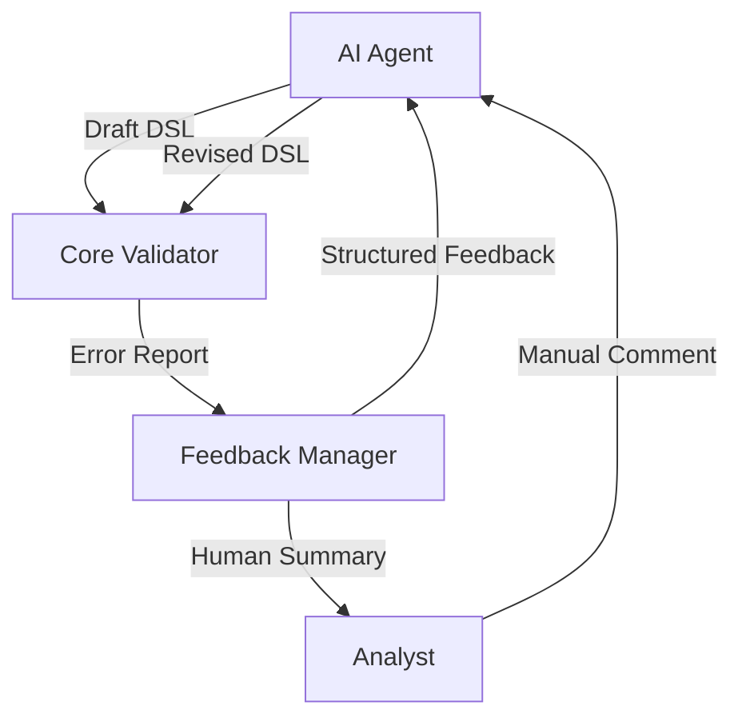

Отлично, мы подошли к финальной логической части SpecRails-архитектуры — **Error Recovery & Feedback Mechanism**.
Это звено, которое превращает “валидацию” из одноразовой проверки в **адаптивный контур обучения системы**.

---

# ⚙️ **SpecRails Error Recovery & Feedback Mechanism**

## 🎯 Цель

> Обеспечить автоматическую и человеко-понятную обработку ошибок, возникающих в ходе генерации и проверки DSL, с замкнутым циклом обратной связи для AI агента и аналитика.

---

## 🧩 1. Механизм обратной связи

### Архитектура



---

## 🧠 2. Компоненты

| Компонент               | Роль                                                       | Ключевые данные                      |
| ----------------------- | ---------------------------------------------------------- | ------------------------------------ |
| **Core Validator**      | Генерирует машинный отчёт об ошибках (JSON)                | `field`, `issue`, `severity`, `hint` |
| **Feedback Manager**    | Преобразует отчёт в читаемый контекст для AI и человека    | Natural Language Report + metadata   |
| **AI Repair Loop**      | Повторно формирует DSL с учётом отчёта                     | Использует prompt-контракт           |
| **Human Feedback Loop** | Аналитик вносит замечания, если авто-коррекция некорректна | Natural text feedback                |

---

## 🔁 3. Цикл работы

1. **Core Validator** фиксирует ошибку:

   > missing attribute, wrong type, logical inconsistency
2. **Feedback Manager** классифицирует:

   * синтаксическая, структурная, логическая, бизнес-ошибка;
   * присваивает уровень критичности.
3. **AI Agent** получает JSON-и summary в виде prompt-контракта:

   ```
   You produced invalid DSL. Here are the issues:
   - email: missing required attribute 'required'
   - birthDate: invalid type
   Please regenerate a valid DSL according to schema spec.form.v1.
   ```
4. **AI Repair Loop** создаёт обновлённую версию DSL.
5. **Core** повторно валидирует.
6. Если ошибок нет → DSL передаётся в preview.
7. Если ошибки остаются → Feedback Manager запускает «guided re-prompt» — пошаговую коррекцию.
8. Аналитик при необходимости добавляет ручной комментарий:

   > «Поле *birthDate* должно быть необязательным, но с подсказкой о минимальной дате.»

---

## ⚙️ 4. Категоризация ошибок

| Категория     | Обнаруживает     | Исправляет         | Пример                                        |
| ------------- | ---------------- | ------------------ | --------------------------------------------- |
| **Syntax**    | Parser           | Auto               | Некорректный YAML                             |
| **Structure** | Schema Validator | Auto               | Неверный тип поля                             |
| **Logic**     | Core Rules       | Semi-Auto          | Некорректная комбинация атрибутов             |
| **Semantic**  | Analyst          | Manual / AI-assist | Поле не соответствует контексту бизнес-логики |

---

## 🧩 5. Архитектурный принцип

> **Ошибка — это не конец, а сигнал.**
> Core фиксирует, AI исправляет, Analyst утверждает.
> Любая ошибка становится данными для обучения и уточнения prompt-контрактов.

---

## 🧠 6. Эволюционный контур

Все ошибки логируются в **Feedback Registry** — репозиторий примеров, на основе которых AI постепенно обучается формировать корректные DSL без повторения прежних ошибок.

| Элемент               | Назначение                                  |
| --------------------- | ------------------------------------------- |
| `feedback_logs/`      | журнал ошибок и решений                     |
| `prompt_corrections/` | сохранённые примеры корректировок           |
| `spec_versions/`      | связь между версиями schema и типами ошибок |

---

## 🔒 7. Преимущества

| Аспект                  | Результат                                       |
| ----------------------- | ----------------------------------------------- |
| **Self-Healing System** | AI учится на ошибках Core                       |
| **Transparency**        | Аналитик видит причины и исправления            |
| **Predictability**      | DSL-выводы становятся ближе к детерминированным |
| **Traceability**        | Любая ошибка и исправление имеют историю        |

---

## 🧭 Стратегический вывод

> **SpecRails = самокорректирующаяся система документирования.**
> Ошибки не прячутся, а становятся источником знаний.
> Core обеспечивает жёсткую валидацию,
> AI — адаптивное восстановление,
> аналитик — контроль смысловой достоверности.

---

Хочешь, чтобы я оформил этот материал как отдельный документ
📄 `SpecRails_Error_Recovery_Principle.md`, чтобы зафиксировать его рядом с остальными архитектурными принципами?
