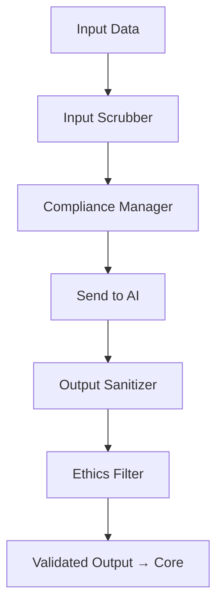

# 🛡️ **SpecRails AI Safety, Compliance & Ethics Layer**

## 🎯 Цель

> Обеспечить безопасность, приватность и этическое соответствие всех взаимодействий с AI в SpecRails, включая защиту данных пользователей, фильтрацию контекста, контроль доступа и управление зонами доверия.

Этот слой гарантирует, что работа AI-агентов SpecRails всегда выполняется в пределах допустимых границ — как юридических, так и моральных, — без нарушения приватности, целостности данных и авторских прав.

---

## 🧩 1. Архитектурная роль

| Компонент                 | Назначение                                                                  |
| ------------------------- | --------------------------------------------------------------------------- |
| **Safety Gateway**        | Фильтрует и проверяет входящие/исходящие данные AI на предмет безопасности  |
| **Compliance Manager**    | Обеспечивает соответствие политике безопасности, GDPR, корпоративным нормам |
| **Data Isolation Engine** | Изолирует контексты по проектам и пользователям                             |
| **Ethics Ruleset**        | Набор принципов и фильтров для контроля поведения AI                        |
| **Sensitive Data Filter** | Распознаёт и маскирует личные и критические данные перед передачей AI       |

---

## ⚙️ 2. Основные цели слоя

1. Гарантировать **безопасную передачу данных** между ядром и AI.
2. Исключить утечку информации о пользователях, проектах и клиентах.
3. Обеспечить **этическое соответствие** поведения AI в рамках аналитических сценариев.
4. Создать инфраструктуру **изолированных когнитивных зон** — AI не имеет доступа к неразрешённым данным.
5. Предоставить механизмы **трассируемости и отчётности** по каждому обращению к AI.

---

## 🧱 3. Механизмы защиты данных

| Механизм                | Описание                                                                         |
| ----------------------- | -------------------------------------------------------------------------------- |
| **Input Scrubber**      | Проверяет контекст перед отправкой AI, удаляя потенциально чувствительные данные |
| **Output Sanitizer**    | Анализирует ответ AI и удаляет случайно включённые фрагменты приватных данных    |
| **Data Masking Layer**  | Замещает имена, email, идентификаторы безопасными токенами                       |
| **Secure Logging**      | Все обращения к AI логируются без хранения исходных персональных данных          |
| **Access Segmentation** | Контексты и контракты отделяются по проектам, ролям и зонам доступа              |

Пример:

```yaml
masked_payload:
  user: "USR_###_A1"
  email: "hidden@example.com"
  entity: "student"
  task: "generate form for registration"
```

---

## ⚖️ 4. Этические принципы (Ethics Ruleset)

| Принцип                 | Описание                                                                |
| ----------------------- | ----------------------------------------------------------------------- |
| **Explainability**      | Каждый ответ AI должен быть объяснимым и логически прослеживаемым       |
| **Non-Personalization** | AI не должен использовать личные данные аналитиков или пользователей    |
| **Transparency**        | Все решения AI должны быть проверяемы человеком                         |
| **Neutrality**          | AI не выражает мнений, не делает моральных суждений и не дискриминирует |
| **Human Override**      | Человек всегда имеет право остановить или переопределить AI-решение     |

---

## 🔒 5. Data Isolation Engine

Каждый проект SpecRails работает в изолированной зоне данных. AI получает доступ **только к тому контексту**, который относится к конкретной задаче.

```yaml
data_isolation:
  zone: "education_project"
  allowed_entities: ["student", "teacher", "course"]
  forbidden_entities: ["finance", "user_credentials"]
  cross_project_access: false
```

Изоляция обеспечивается на уровне Prompt Context Orchestration и Knowledge Base Access Policy.

---

## 🧩 6. Compliance Manager

Compliance Manager интегрируется с политиками безопасности организации:

* поддержка стандартов **GDPR / ISO 27001 / SOC 2**;
* контроль хранения логов (ретенция и маскирование);
* аудит обращений к AI (кто, когда, с каким контрактом);
* контроль экспортов и передачи данных вне безопасной зоны SpecRails.

```yaml
audit_entry:
  actor: "analyst_viktor"
  contract_used: "form.contract.v2"
  data_zone: "education_project"
  ai_model: "gpt-5"
  result_status: "validated"
  compliance_check: "passed"
```

---

## ⚙️ 7. Safety Gateway Workflow



---

## 🧠 8. Метрики безопасности и соответствия

| Метрика                          | Назначение                                           |
| -------------------------------- | ---------------------------------------------------- |
| **Leak Prevention Rate**         | % предотвращённых утечек данных                      |
| **Masked Field Ratio**           | Среднее число замаскированных полей на 100 обращений |
| **Compliance Pass Rate**         | Доля успешных проверок соответствия политикам        |
| **Anomaly Detection Count**      | Количество выявленных аномалий в поведении AI        |
| **Human Intervention Frequency** | Частота ручных остановок или переопределений AI      |

---

## 🧭 9. Архитектурный принцип

> **Безопасность и этика — не надстройка, а часть ядра.**
> Любое взаимодействие с AI должно быть воспроизводимым, прозрачным и безопасным по умолчанию.
> В SpecRails AI — не просто исполнитель, а участник регулируемой системы, где человек и архитектура определяют границы допустимого.
