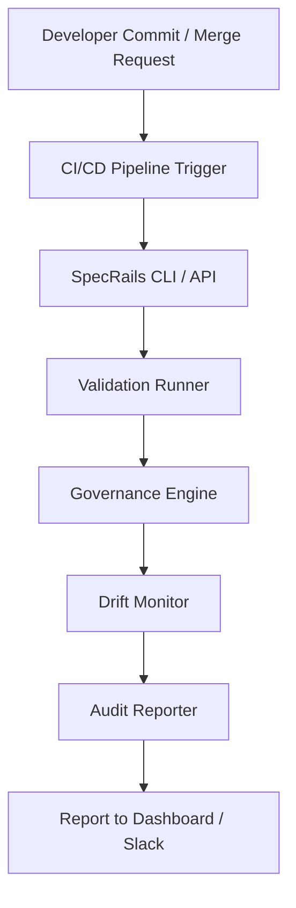

# 🔄 **SpecRails CI/CD Integration & Automated Governance**

## 🎯 Цель

> Описать, как SpecRails интегрируется в конвейеры CI/CD, обеспечивая автоматическую проверку контрактов, контроль drift, валидацию спецификаций и управление изменениями через систему approvals и Governance Layer.

SpecRails предназначен для включения в инженерные и аналитические пайплайны, превращая генерацию AI-артефактов в контролируемый, воспроизводимый и сертифицируемый процесс.

---

## 🧩 1. Архитектурная роль

| Компонент             | Назначение                                                                      |
| --------------------- | ------------------------------------------------------------------------------- |
| **CI/CD Adapter**     | Связывает SpecRails с внешними пайплайнами (GitHub Actions, GitLab CI, Jenkins) |
| **Governance Engine** | Контролирует политику изменений, approvals и соответствие контрактам            |
| **Drift Monitor**     | Проверяет стабильность AI-поведения между сборками                              |
| **Validation Runner** | Автоматически верифицирует DSL, контракты и спецификации                        |
| **Audit Reporter**    | Генерирует отчёты и отправляет их в Observability Layer                         |

---

## ⚙️ 2. Цепочка интеграции



---

## 🧱 3. Пример интеграции с GitHub Actions

```yaml
name: SpecRails Validation
on:
  pull_request:
    branches: [ main, develop ]

jobs:
  specrails-validate:
    runs-on: ubuntu-latest
    steps:
      - uses: actions/checkout@v4
      - name: Install SpecRails CLI
        run: npm install -g @specrails/cli
      - name: Validate Specifications
        run: specrails validate --contracts all --strict
      - name: Check Drift
        run: specrails check drift --threshold 0.05
      - name: Generate Report
        run: specrails report --format html --output ./reports/specrails.html
```

---

## 🧠 4. Политика автоматического Governance

Governance Engine обеспечивает контроль над изменениями в спецификациях, контрактах и утилитах:

| Политика            | Назначение                                                     |
| ------------------- | -------------------------------------------------------------- |
| **Contract Lock**   | Запрещает изменение контрактов без апрува архитектора          |
| **Spec Approval**   | Требует ревью при модификации спецификаций форм и моделей      |
| **Drift Policy**    | Блокирует сборку, если AI-поведение отклоняется от эталона >5% |
| **Audit Trail**     | Логирует все изменения DSL, контекстов и политик               |
| **Validation Gate** | Не допускает деплой без успешной валидации всех артефактов     |

---

## 📋 5. Governance Policy YAML

```yaml
governance_policy:
  contracts:
    require_approval: true
    allowed_roles: ["architect", "lead_analyst"]
  specs:
    require_validation: true
    auto_correct: false
  drift:
    enabled: true
    threshold: 0.05
  audit:
    report_format: "json"
    retention_days: 90
```

---

## 🧩 6. Drift Detection в CI/CD

```bash
specrails check drift --baseline refs/tags/v0.1 --contracts
```

**Результат анализа:**

```yaml
drift_report:
  contract: "form.contract.v2"
  baseline_ref: "v0.1"
  drift_score: 0.034
  status: "stable"
  recommendation: "no action required"
```

Если drift превышает порог — создаётся инцидент:

```yaml
drift_alert:
  id: "DRIFT-2025-11-06-02"
  contract: "form.contract.v2"
  score: 0.076
  action: "block-deploy"
```

---

## 🧩 7. Validation Runner

Validation Runner автоматически проверяет корректность всех спецификаций перед релизом:

```bash
specrails validate --contracts all --schema-check
```

Пример отчёта:

```yaml
validation_summary:
  total_specs: 54
  passed: 53
  failed: 1
  errors:
    - file: "form.guardian.v1.yaml"
      issue: "Missing field label"
      severity: "medium"
```

---

## 🔍 8. Audit Reporter

Audit Reporter создаёт цифровые следы всех изменений, включая подписи пользователей и хэши файлов.

```yaml
audit_entry:
  id: "AUD-2025-11-06-04"
  author: "analyst_viktor"
  action: "modify spec"
  file: "model.student.v1.yaml"
  checksum_old: "a4c9f3..."
  checksum_new: "b19a4d..."
  validation: "passed"
  timestamp: "2025-11-06T22:40:00Z"
```

---

## ⚙️ 9. Notifications & Alerts

Интеграция с внешними системами оповещений:

* **Slack / Mattermost** — уведомления об ошибках, дрейфе и блокировках.
* **Jira / YouTrack** — автоматическое создание тикетов при инцидентах.
* **Email / Webhook** — отчёты о nightly-валидации и drift-трендах.

Пример Slack-уведомления:

```yaml
alert:
  type: "drift_detected"
  message: "⚠️ Contract form.contract.v2 drift exceeded 0.05"
  url: "https://specrails.observability/reports/DRIFT-2025-11-06-02"
```

---

## 📊 10. Метрики автоматического контроля

| Метрика                    | Назначение                                      |
| -------------------------- | ----------------------------------------------- |
| **Validation Pass Rate**   | Процент успешных проверок контрактов            |
| **Drift Stability Index**  | Среднее отклонение AI между версиями            |
| **Spec Review Compliance** | Доля спецификаций, прошедших ревью              |
| **Blocked Deployments**    | Количество остановленных сборок из-за нарушений |
| **Governance Latency**     | Время от изменения до утверждения               |

---

## 🧭 11. Архитектурный принцип

> **CI/CD — это не просто автоматизация, а дисциплина доверия.**
> SpecRails превращает генерацию спецификаций из хаотичного AI-процесса в управляемый инженерный цикл,
> где каждая итерация проверена, воспроизводима и имеет цифровой след.
