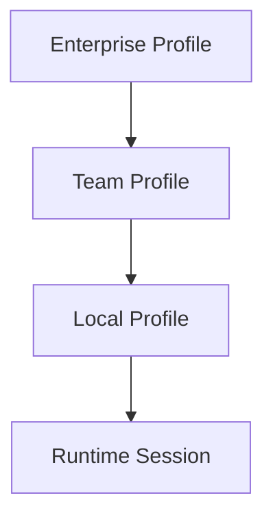

# ⚙️ **SpecRails Configuration, Policies & Environment Profiles**

## 🎯 Цель

> Описать систему конфигурации SpecRails, определяющую параметры окружения, политики безопасности, AI-провайдеров, контексты и настройки выполнения.
> Обеспечить гибкую адаптацию SpecRails к различным сценариям: локальная аналитика, командная работа и корпоративное использование.

---

## 🧩 1. Концепция конфигурации

SpecRails использует **трёхуровневую модель конфигурации**, которая обеспечивает баланс между гибкостью и безопасностью:

| Уровень                | Назначение                                                      |
| ---------------------- | --------------------------------------------------------------- |
| **Local Profile**      | Персональные настройки аналитика (IDE, AI-провайдер, интерфейс) |
| **Team Profile**       | Общие настройки команды, контракты, shared policies             |
| **Enterprise Profile** | Централизованное управление, безопасность, observability, CI/CD |

Каждый уровень хранится в отдельном YAML/JSON-файле и объединяется по принципу наследования: `local > team > enterprise`.

---

## 🧱 2. Структура конфигурации

```yaml
specrails_config:
  version: 1.0
  environment: "team"
  ai_provider:
    default: "openai:gpt-5"
    fallback: "anthropic:claude-3.5"
  context:
    domain: "education"
    language: "ru"
  policies:
    sandbox: "policies/sandbox.team.yaml"
    security: "policies/security.shared.yaml"
  storage:
    path: "./.specrails/"
    cache_ttl_hours: 24
  observability:
    telemetry: true
    log_level: "info"
  ui:
    theme: "minimal"
    auto_preview: true
```

---

## ⚙️ 3. Иерархия профилей окружений



### **Enterprise Profile**

* Определяет глобальные политики, допустимые AI-провайдеры, CI/CD-интеграции.
* Контролируется через централизованный `specrails-enterprise.yaml`.

### **Team Profile**

* Управляет общими контрактами и контекстами проектов.
* Настраивает правила совместного доступа и observability.

### **Local Profile**

* Содержит пользовательские предпочтения и личные ключи API.
* Может переопределять только часть параметров (UI, AI provider, language).

---

## 🔐 4. Пример Enterprise Profile

```yaml
specrails_enterprise:
  ai_providers:
    allowed:
      - "openai:gpt-5"
      - "anthropic:claude-3.5"
    forbidden:
      - "local:experimental-llm"
  security:
    sandbox_policy: "policies/enterprise.sandbox.yaml"
    access_control:
      rbac: "roles/enterprise.rbac.yaml"
  telemetry:
    observability_endpoint: "https://telemetry.specrails.io"
    anonymize_data: true
  ci_cd:
    drift_check: true
    auto_validation: true
```

---

## 🧠 5. Механизм наследования и приоритизации

| Приоритет | Уровень                | Поведение при конфликте                                 |
| --------- | ---------------------- | ------------------------------------------------------- |
| 1️⃣       | **Local Profile**      | Может переопределять визуальные и AI-настройки          |
| 2️⃣       | **Team Profile**       | Имеет приоритет над enterprise при проектных изменениях |
| 3️⃣       | **Enterprise Profile** | Имеет высший приоритет для политик безопасности         |

---

## 🧩 6. Политики безопасности и выполнения

Каждая политика хранится в `.specrails/policies/` и подключается в конфигурации.

```yaml
sandbox_policy:
  timeout_ms: 4000
  cpu_limit_ms: 1200
  memory_limit_mb: 128
  allowed_apis:
    - "PromptAPI"
    - "ContextAPI"
  telemetry_enabled: true

security_policy:
  access_control:
    roles:
      - analyst
      - reviewer
    permissions:
      - read: ["specs", "contracts"]
      - write: ["specs/local"]
      - execute: ["utilities"]
```

---

## 🧩 7. AI Provider Configuration

```yaml
ai_provider:
  default: "openai:gpt-5"
  fallback: "anthropic:claude-3.5"
  options:
    openai:
      api_key: "env:OPENAI_API_KEY"
      temperature: 0.3
      max_tokens: 4096
    anthropic:
      api_key: "env:ANTHROPIC_API_KEY"
      temperature: 0.2
      max_tokens: 4096
```

**Принцип:** ключи никогда не хранятся в открытом виде — только ссылки на `env:` переменные или `vault:` записи.

---

## 🧱 8. Контексты и сценарии выполнения

```yaml
context_profiles:
  default:
    domain: "education"
    language: "ru"
    mode: "spec-generation"
  validation:
    mode: "contract-check"
  review:
    mode: "human-feedback"
```

Профили контекста определяют поведение AI Runtime и способ обработки входных данных (генерация, валидация, пересборка).

---

## ⚙️ 9. Observability & Telemetry Settings

```yaml
observability:
  enabled: true
  log_level: "debug"
  telemetry_endpoint: "https://telemetry.specrails.io"
  drift_threshold: 0.05
  metrics:
    - drift_index
    - validation_rate
    - sandbox_violations
```

---

## 🧩 10. Управление конфигурацией через CLI

```bash
specrails config view --scope team
specrails config edit --scope local
specrails config sync --from enterprise
specrails config diff --env local --target team
```

CLI-команды позволяют сравнивать, наследовать и синхронизировать конфигурации между профилями.

---

## 📊 11. Мониторинг и drift-проверки

```bash
specrails check drift --contracts
specrails audit policies --level enterprise
specrails validate env --scope team
```

**Проверки выполняются автоматически** в CI/CD pipeline, чтобы гарантировать стабильность политик и конфигураций.

---

## 🧭 12. Архитектурный принцип

> **Конфигурация — это не настройка, а декларация среды доверия.**
> В SpecRails каждая переменная, политика или ключ — часть контракта, а не случайный параметр.
> Благодаря профилям окружения, система остаётся воспроизводимой и контролируемой — от локального workspace до корпоративного кластера.
