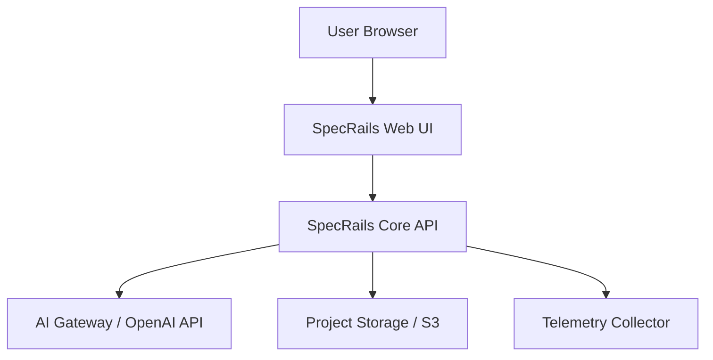
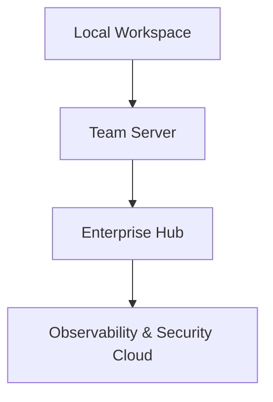

# 🚀 **SpecRails Deployment & Integration Framework**

## 🎯 Цель

> Определить архитектуру развертывания SpecRails и подходы к интеграции с внешними системами (IDE, AI-провайдеры, облачные сервисы, CI/CD-пайплайны), сохраняя модульность, управляемость и изоляцию контуров.

---

## 🧩 1. Общая концепция

SpecRails проектируется как **модульный инструмент аналитической автоматизации**, способный работать в трёх режимах:

| Режим              | Описание                                                              | Пример окружения                 |
| ------------------ | --------------------------------------------------------------------- | -------------------------------- |
| **Embedded**       | Встраивается как расширение в IDE (VS Code, JetBrains, Cursor)        | `AI Spec Studio Plugin`          |
| **Standalone Web** | Запускается как браузерное приложение или локальный сервер            | `localhost:5080/specrails`       |
| **Headless API**   | Используется как сервис в составе CI/CD или интеграционного пайплайна | `specrails-cli --generate forms` |

Все три режима используют общее ядро SpecRails Core и общий Prompt Governance Layer, обеспечивая идентичное поведение независимо от окружения.

---

## ⚙️ 2. Компоненты развертывания

| Компонент           | Назначение                                                             |
| ------------------- | ---------------------------------------------------------------------- |
| **Core Runtime**    | Исполняет процессы генерации, валидации и сборки DSL                   |
| **UI Layer**        | Отображает формы, превью и диаграммы (WebView / HTML Canvas)           |
| **AI Connector**    | Управляет подключениями к AI-провайдерам (OpenAI, Anthropic, Azure AI) |
| **Storage Module**  | Хранит локальные и проектные данные (JSON/YAML specs, history, cache)  |
| **Telemetry Agent** | Отправляет логи и метрики в Observability Layer                        |

---

## 🧠 3. Deployment Topologies

### 🧩 A. IDE Integration (VS Code / JetBrains)

* Расширение `specrails.plugin` интегрируется в панель инструментов IDE.
* Поддерживает интерактивные команды (`/generate`, `/compose`, `/preview`).
* Использует встроенный WebView для визуализации форм.
* Все данные хранятся в `.specrails/` внутри проекта.

**Преимущества:**

* Мгновенный доступ к AI через локальные команды.
* Изоляция от основной IDE среды.
* Возможность офлайн-работы с кешированными контрактами.

```bash
.specrails/
  ├── config.json
  ├── contracts/
  ├── cache/
  ├── runtime.log
  └── specs/
      ├── form.student.v1.yaml
      └── model.guardian.v1.yaml
```

---

### 🧩 B. Web Application

* Развёртывается как SPA (Single Page Application) + Node.js backend.
* Основные компоненты: `specrails-core`, `specrails-ui`, `specrails-api`.
* Использует WebSocket для взаимодействия между AI Runtime и UI Preview.
* Может подключаться к корпоративным AI Gateway (с поддержкой токенов и прокси).



---

### 🧩 C. Headless Runtime (CLI / API Mode)

Используется в CI/CD и автоматизированных пайплайнах:

```bash
specrails generate --contract form.contract.v2 --input story.yaml --output ./specs/
```

* Поддерживает интеграцию с GitLab, GitHub Actions, Jenkins.
* Возможна проверка drift и консистентности в merge request’ах.
* Использует audit trail для отслеживания изменений DSL.

---

## 🔗 4. Интеграция с внешними системами

| Система                             | Интеграция     | Назначение                                     |
| ----------------------------------- | -------------- | ---------------------------------------------- |
| **GitHub / GitLab**                 | CI/CD Hooks    | Генерация и проверка спецификаций при коммитах |
| **SpecKit / Copilot / Cursor**      | AI Tools       | Совместное использование Prompt Contracts      |
| **OpenAI / Anthropic / Local LLMs** | AI Providers   | Подключение моделей через API / Gateway        |
| **MinIO / AWS S3**                  | Object Storage | Хранение файлов спецификаций и DSL архивов     |
| **Vault / Secrets Manager**         | Security       | Управление ключами и доступом к AI API         |
| **Grafana / Loki / ELK**            | Monitoring     | Аналитика телеметрии и drift показателей       |

---

## 📦 5. Схема окружений (Deployment Layers)

| Уровень        | Назначение                                                                |
| -------------- | ------------------------------------------------------------------------- |
| **Local**      | Разработка и тестирование аналитиков                                      |
| **Team**       | Совместная работа и проверка контрактов                                   |
| **Enterprise** | Централизованное управление политиками, безопасностью и CI/CD интеграцией |



---

## 🔐 6. Политика безопасности и обновлений

* Контракты и модули подписываются цифровыми хешами SHA256.
* Обновления распространяются через **SpecRails Package Registry (SRPR)**.
* Каждое обновление проходит стадию **sandbox-валидации**.
* Runtime поддерживает rollback на предыдущие версии контрактов.

```yaml
update_manifest:
  package: "prompt.contracts.ui"
  version: "2.3.1"
  checksum: "9d85a2b6..."
  verified: true
  status: "staged"
```

---

## 🧠 7. Telemetry & CI Integration Hooks

* `specrails telemetry push` — отправка метрик drift и stability.
* `specrails validate --contract` — проверка контрактов перед деплоем.
* `specrails report --format html` — формирование отчётов для ревью.

**GitHub Actions Example:**

```yaml
jobs:
  validate-specs:
    runs-on: ubuntu-latest
    steps:
      - uses: actions/checkout@v4
      - name: Validate SpecRails Contracts
        run: specrails validate --contract all
```

---

## 🧭 8. Архитектурный принцип

> **SpecRails — это не среда исполнения, а инфраструктура доверия.**
> Она должна одинаково работать в IDE, на сервере и в CI, обеспечивая одинаковую предсказуемость и контроль над AI.
> Любое окружение SpecRails — это узел единой сети воспроизводимости.
