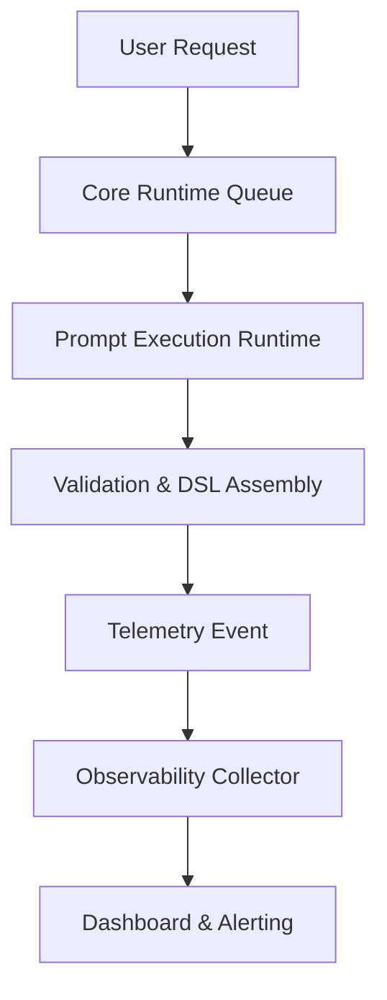

# ⚙️ **SpecRails Operational Runtime & Observability Layer**

## 🎯 Цель

> Определить, как SpecRails выполняет, мониторит и анализирует работу всех своих модулей в реальном времени, обеспечивая стабильность, прозрачность и воспроизводимость AI-интеракций и процессов генерации спецификаций.

Этот слой объединяет технический мониторинг (runtime, performance, telemetry) и когнитивный контроль (drift, consistency, output coherence), превращая SpecRails в наблюдаемую, предсказуемую и управляемую систему.

---

## 🧩 1. Архитектурная роль

| Компонент                   | Назначение                                                 |
| --------------------------- | ---------------------------------------------------------- |
| **Runtime Core**            | Выполняет и координирует работу всех компонентов SpecRails |
| **Metrics Collector**       | Собирает телеметрию и показатели производительности        |
| **Drift Analyzer**          | Отслеживает отклонения в поведении AI и DSL-результатов    |
| **Log & Trace Engine**      | Фиксирует пошаговые действия, ошибки и контекстные события |
| **Observability Dashboard** | Интерфейс визуализации метрик и состояния системы          |

---

## ⚙️ 2. Основные цели слоя

1. Обеспечить прозрачное выполнение AI-интеракций и DSL-процессов.
2. Давать разработчикам и аналитикам обратную связь о стабильности и качестве генераций.
3. Отслеживать дрейф поведения моделей и контрактов.
4. Поддерживать realtime-мониторинг для анализа производительности и контекста.
5. Предоставить основу для автоматической диагностики и самоисправления.

---

## 🧱 3. Runtime Execution Pipeline



---

## 🧠 4. Метрики наблюдаемости

| Категория               | Метрика               | Назначение                                    |
| ----------------------- | --------------------- | --------------------------------------------- |
| **Performance**         | Execution Time        | Среднее время генерации/валидации DSL         |
|                         | Model Response Time   | Скорость ответа AI                            |
| **Quality**             | Output Validity Rate  | Доля успешных валидаций по DSL-схемам         |
|                         | Drift Index           | Измеряет отклонения от эталонного поведения   |
| **Reliability**         | Error Frequency       | Частота системных или AI ошибок               |
|                         | Recovery Success Rate | Эффективность восстановления после сбоев      |
| **Cognitive Stability** | Consistency Score     | Согласованность ответов AI между итерациями   |
| **User Feedback Loop**  | Correction Impact     | Доля фидбэков, улучшивших итоговые результаты |

---

## 🔍 5. Drift Analyzer

Drift Analyzer отслеживает:

* изменение структуры DSL по сравнению с эталонными шаблонами;
* смещение тональности, стиля или формата генераций;
* отклонения в логике заполнения форм и схем;
* накопление статистического дрейфа в Prompt Contracts.

Пример вывода:

```yaml
drift_report:
  contract: "form.contract.v2"
  baseline_ref: "2025-09-01"
  drift_score: 0.037
  affected_components: ["ui.field_label", "validation.rules"]
  action: "review_suggested"
```

---

## 🧩 6. Log & Trace Engine

Каждое обращение к AI фиксируется в журнале событий, включая:

* используемый контракт и контекст;
* итоговый DSL и валидацию;
* ошибки и время реакции;
* обратную связь от пользователя.

```yaml
trace_event:
  session: "sess-edu-0014"
  user: "analyst_viktor"
  action: "generate form"
  ai_model: "gpt-5"
  contract_used: "form.contract.v2"
  result: "validated"
  duration_ms: 2048
  drift_score: 0.012
```

---

## 📊 7. Observability Dashboard

**UI-компоненты:**

* Real-time Stream: активные задачи и статус выполнения;
* AI Stability Chart: показатели дрейфа и консистентности;
* Feedback Metrics: результаты фидбэков аналитиков;
* Contract Health Map: активные и устаревшие контракты;
* Context Depth Graph: визуализация количества слоёв контекста.

---

## 🧩 8. Self-Diagnostics & Alerts

SpecRails использует систему событийных уведомлений:

* **Critical Drift Alert:** модель отклонилась от эталона > 5%;
* **Prompt Timeout:** превышено время ответа;
* **Contract Deviation:** нарушена схема DSL;
* **Feedback Surge:** слишком много пользовательских правок.

```yaml
alert_event:
  id: "ALR-DRIFT-009"
  severity: "critical"
  message: "Prompt contract drift detected: form.contract.v2"
  threshold: 0.05
  timestamp: "2025-11-06T21:52:00Z"
```

---

## 🧠 9. Telemetry Collection Protocol

| Компонент              | Тип данных                    | Частота    |
| ---------------------- | ----------------------------- | ---------- |
| **Runtime Core**       | Execution, Validation, Errors | Real-time  |
| **Drift Analyzer**     | Drift Scores, Baselines       | Every 24h  |
| **Feedback Loop**      | Corrections, Adjustments      | Continuous |
| **Contracts Registry** | Version Updates               | On change  |
| **System Health**      | CPU, Memory, Queue Load       | Every 10s  |

---

## 🧭 10. Архитектурный принцип

> **Наблюдаемость — форма памяти системы.**
> SpecRails не просто исполняет операции, а помнит, как и почему они были выполнены.
> Любая генерация должна быть объяснима, измерима и поддающаяся аудиту.
