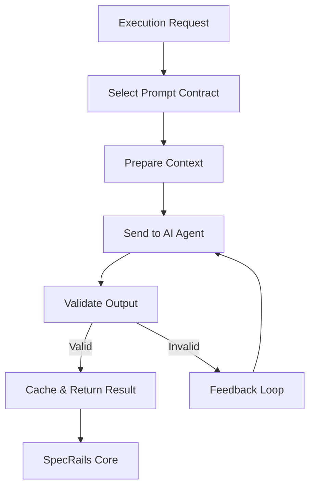

# ⚙️ **SpecRails Prompt Execution Runtime**

## 🎯 Цель

> Определить, как ядро SpecRails выполняет Prompt Contracts при обращении к AI-агенту, обеспечивая воспроизводимость, контроль качества и устойчивость при ошибках.

Этот слой — «мотор» Prompt Governance System: он превращает контракты в управляемые вызовы AI, применяет политики кеширования, ретраев и фидбэка, и гарантирует, что каждая генерация проходит через валидированные этапы исполнения.

---

## 🧩 1. Архитектурная роль

| Компонент             | Назначение                                                                           |
| --------------------- | ------------------------------------------------------------------------------------ |
| **Prompt Runner**     | Исполняет контракт: формирует промт, отправляет его в AI, получает результат         |
| **Execution Context** | Содержит параметры вызова (контекст, версия контракта, AI-модель)                    |
| **Validator**         | Проверяет, что ответ AI соответствует ожидаемой схеме                                |
| **Feedback Loop**     | Повторно инициирует запрос с учётом замечаний или ошибок                             |
| **Cache Layer**       | Сохраняет успешные результаты для ускорения повторных запросов                       |
| **Fallback Policy**   | Определяет поведение при сбое (альтернативная модель, контракт, статичный результат) |

---

## 🧠 2. Поток выполнения



---

## ⚙️ 3. Execution Context

```yaml
execution_context:
  contract_id: "form.contract.v2"
  ai_model: "gpt-5"
  input_text: "Создай форму профиля студента"
  project: "education"
  locale: "ru"
  version: "2.1.0"
  retries: 0
```

Контекст создаётся ядром и сохраняется в Audit Trail для воспроизводимости.

---

## 🔁 4. Механизм Feedback Loop

| Событие             | Действие                                          | Описание                                                    |
| ------------------- | ------------------------------------------------- | ----------------------------------------------------------- |
| **Invalid Output**  | Повтор с уточнением контекста                     | AI получает подсказку: "output invalid — fix schema errors" |
| **Partial Success** | Повтор с сохранением валидных частей              | Только проблемные сегменты проходят повторную генерацию     |
| **Human Feedback**  | Запускается цикл коррекции по замечанию аналитика | Аналитик указывает, что не так — AI обновляет DSL           |
| **Timeout**         | Используется fallback контракт                    | Runtime выбирает запасной контракт                          |

---

## 💾 5. Cache Layer

| Тип кеша             | Содержание                              | TTL    |
| -------------------- | --------------------------------------- | ------ |
| **Prompt Cache**     | Хранит исходные промты и ответы AI      | 24 ч   |
| **Validation Cache** | Результаты успешной валидации DSL       | 72 ч   |
| **Feedback Cache**   | Хранит ошибочные кейсы и их исправления | 7 дней |

> **Правило:** кеши не заменяют контракт, но помогают избежать повторных обращений при одинаковых условиях.

---

## 🔐 6. Fallback Policy

```yaml
fallback_policy:
  order:
    - retry_contract: "form.contract.v1"
    - retry_model: "gpt-4"
    - use_static_template: true
  max_retries: 3
  delay_between_retries: 5s
```

Fallback обеспечивает устойчивость: если AI не справился, SpecRails может переключиться на предыдущую версию контракта или модель, сохранив консистентность результата.

---

## 🧱 7. Validator

Validator — ключевой элемент Runtime. Он:

* сверяет результат AI с JSON Schema;
* проверяет наличие обязательных полей;
* нормализует формат (например, YAML → JSON);
* возвращает отчёт об ошибках в Feedback Loop.

```yaml
validation_result:
  valid: false
  errors:
    - path: "/fields/0/type"
      message: "unknown type 'dropdownx'"
```

---

## 🧭 8. Execution Policy Levels

| Уровень         | Назначение                                         | Применяется к             |
| --------------- | -------------------------------------------------- | ------------------------- |
| **Strict**      | Валидация жёсткая, результат AI не корректируется  | DSL generation core       |
| **Adaptive**    | AI может внести правки после замечаний             | preview / visual feedback |
| **Exploratory** | Разрешены вариации при исследовательских сценариях | sandbox mode              |

---

## 📊 9. Метрики исполнения

| Метрика                  | Описание                                                 |
| ------------------------ | -------------------------------------------------------- |
| **Success Rate**         | Доля успешных валидаций без ретраев                      |
| **Avg Retry Depth**      | Среднее число итераций до стабильного результата         |
| **Cache Hit Ratio**      | Эффективность кеширования                                |
| **AI Drift Index**       | Изменение предсказуемости вывода по сравнению с эталоном |
| **Human Feedback Ratio** | Доля запросов, скорректированных пользователем           |

---

## 🧩 10. Архитектурный принцип

> **Prompt Execution Runtime — это детерминизирующий слой над вероятностным AI.**
> Он делает работу AI управляемой, верифицируемой и наблюдаемой.

SpecRails Runtime не пытается сделать AI умнее — он делает его **предсказуемым, воспроизводимым и безопасным** в инженерном контексте.
