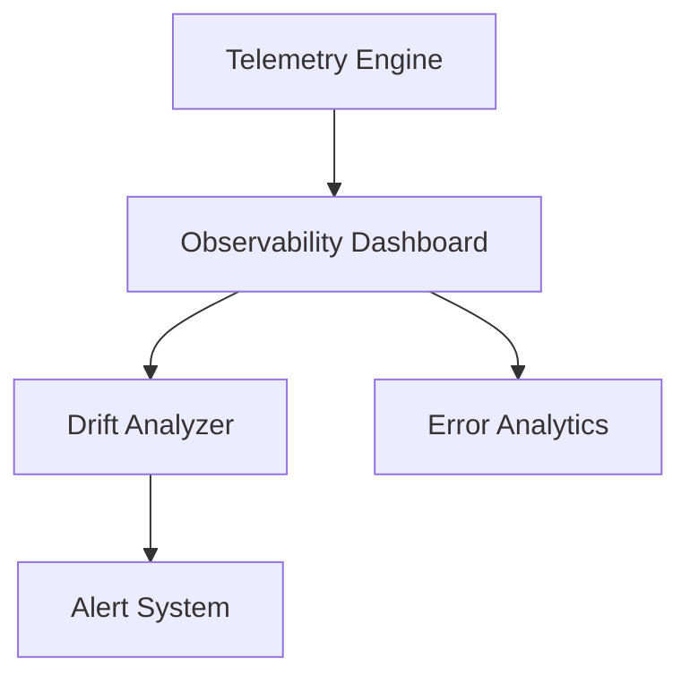

# 🔍 **SpecRails Prompt Observability & Drift Control**

## 🎯 Цель

> Создать прозрачный механизм наблюдения и анализа качества взаимодействия AI ↔ Prompt Contracts ↔ SpecRails Core,
> а также систему контроля дрейфа (drift control), фиксирующую отклонения в поведении моделей и контрактов во времени.

SpecRails должен не только исполнять контракты, но и **наблюдать** за тем, как AI фактически их выполняет — фиксируя деградации, расхождения и тренды в генерации DSL.

---

## 🧩 1. Архитектурная роль

| Компонент                    | Назначение                                                          |
| ---------------------------- | ------------------------------------------------------------------- |
| **Prompt Telemetry Engine**  | Сбор метрик и событий при каждом вызове AI                          |
| **Drift Analyzer**           | Отслеживает статистические отклонения в поведении моделей           |
| **Error Analytics**          | Анализирует частоту ошибок, причины и корреляции                    |
| **Human Feedback Collector** | Агрегирует замечания аналитиков для улучшения промтов               |
| **Observability Dashboard**  | Визуализирует тренды, стабильность и качество выполнения контрактов |

---

## 📈 2. Основные цели наблюдаемости

1. **Отслеживание консистентности:** одинаковые входы → одинаковые DSL-результаты.
2. **Измерение стабильности контрактов:** насколько предсказуемо AI следует инструкциям.
3. **Детекция дрейфа моделей:** выявление статистических сдвигов в поведении AI при неизменных контрактах.
4. **Поддержка обратной связи:** фиксация человеческих замечаний как формализованных данных.
5. **Аудит качества генераций:** прозрачность и проверяемость для команд аналитики и архитектуры.

---

## 🧠 3. Метрики наблюдаемости

| Категория     | Метрика                    | Описание                                          |
| ------------- | -------------------------- | ------------------------------------------------- |
| **Execution** | `success_rate`             | Доля успешных валидаций DSL                       |
|               | `retry_depth_avg`          | Среднее количество повторных генераций            |
|               | `avg_latency`              | Среднее время ответа AI                           |
| **Quality**   | `validation_error_density` | Количество ошибок на 100 ответов                  |
|               | `schema_violation_rate`    | Частота несоответствий схеме DSL                  |
|               | `prompt_entropy_index`     | Изменчивость выходов при идентичных входах        |
| **Feedback**  | `human_feedback_ratio`     | Доля результатов, скорректированных пользователем |
|               | `feedback_accept_rate`     | Доля успешных исправлений после фидбэка           |
| **Drift**     | `model_drift_index`        | Среднее отклонение токенов/структуры от эталона   |
|               | `prompt_contract_drift`    | Доля контрактов с изменённой предсказуемостью     |

---

## 🧩 4. Drift Analyzer

### Задачи

* Сравнивает новые результаты генераций с эталонными (baseline outputs).
* Использует статистические и семантические метрики (например, Levenshtein distance, JSON-schema deviation).
* Сигнализирует при превышении порога дрейфа.

### Пример отчёта:

```yaml
drift_report:
  model: "gpt-5"
  baseline_contract: "form.contract.v2"
  sample_size: 300
  avg_schema_deviation: 4.7%
  semantic_similarity_drop: 6.1%
  threshold_exceeded: true
  suggested_action: "Revalidate contract with updated schema"
```

---

## 🧩 5. Feedback Analytics

Система собирает обратную связь аналитиков и классифицирует её по типу ошибок:

| Тип               | Пример                          | Автоматическая реакция                             |
| ----------------- | ------------------------------- | -------------------------------------------------- |
| **Семантическая** | Неправильно истолкован контекст | Перегенерация с уточнением контекста               |
| **Форматная**     | Нарушена структура YAML         | Повтор с указанием формата                         |
| **Пропуск полей** | Отсутствует обязательное поле   | Контракт получает патч с уточнением `must_include` |
| **Визуальная**    | Ошибка в preview                | Передача на ручную проверку                        |

---

## 🔍 6. Telemetry Logging Schema

```yaml
telemetry_entry:
  timestamp: "2025-11-06T22:35:00Z"
  contract: "model.contract.v2"
  ai_model: "gpt-5"
  latency_ms: 2150
  validation_result: "passed"
  retry_count: 1
  human_feedback: false
  drift_score: 0.021
```

> Все записи хранятся в Observability Storage и используются для метаанализа стабильности контрактов.

---

## ⚙️ 7. Observability Dashboard

Панель наблюдения должна отображать:

* текущие активные контракты и их статус исполнения;
* стабильность моделей AI во времени;
* распределение ошибок и их типы;
* человеческий фидбэк и частоту его применения;
* тренды дрейфа (сигналы деградации).



---

## 🔒 8. Drift Control Policy

```yaml
drift_policy:
  threshold_schema_deviation: 5%
  threshold_semantic_drift: 7%
  notify_on_violation: true
  actions:
    - alert_team: "prompt-governance@specrails.dev"
    - lock_contract: true
    - schedule_retraining: false
```

Если дрейф превышает порог, система может автоматически:

* заморозить контракт (lock);
* уведомить команду Governance;
* инициировать аудит модели.

---

## 🧩 9. Интеграция с Prompt Lifecycle

* Каждая публикация контракта сопровождается **baseline-снимком** для анализа дрейфа.
* При переходе версии в `deprecated` или `archived` происходит экспорт всех метрик drift и feedback.
* Drift Analyzer может запускать **автоматический rollback** при обнаружении деградации более 10% от baseline.

---

## 🧭 10. Архитектурный принцип

> **Наблюдаемость — это не метрики, а доверие.**
> Drift Control — способ сохранить предсказуемость SpecRails, даже если AI меняется.

SpecRails не может предотвратить стохастику AI, но может **управлять её последствиями** — через наблюдение, сравнение и адаптивное регулирование контрактов.
