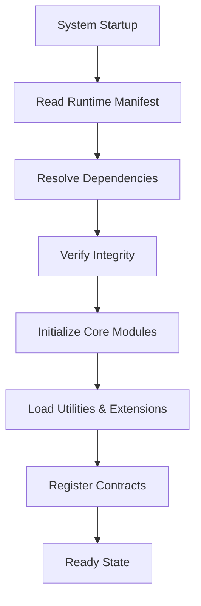

# 🧩 **SpecRails Runtime Manifest & Module Registry**

## 🎯 Цель

> Определить архитектуру загрузки, регистрации и управления модулями, утилитами и контрактами в процессе выполнения SpecRails.
> Обеспечить воспроизводимость, безопасность и прозрачность при старте и работе системы.

Runtime Manifest и Module Registry — это ядро, которое контролирует, какие компоненты SpecRails активируются, в какой последовательности и с какими зависимостями. Оно делает систему **самоописывающейся**, **версионируемой** и **диагностируемой**.

---

## 🧩 1. Архитектурная роль

| Компонент               | Назначение                                                         |
| ----------------------- | ------------------------------------------------------------------ |
| **Runtime Manifest**    | Декларация всех активных модулей, утилит, контрактов и их версий   |
| **Module Registry**     | Управляет регистрацией, загрузкой и инициализацией модулей         |
| **Dependency Resolver** | Проверяет зависимости между компонентами и предотвращает конфликты |
| **Sandbox Loader**      | Обеспечивает изоляцию выполнения и контроль доступа к API          |
| **Integrity Verifier**  | Проверяет подписи и хэши модулей для безопасности                  |

---

## ⚙️ 2. Структура Runtime Manifest

```yaml
runtime_manifest:
  version: 1.2.0
  build: 2025-11-06
  environment: "vscode-plugin"
  modules:
    - name: "core.runtime"
      version: "1.0.0"
      entry: "@specrails/core/runtime.js"
    - name: "form.builder"
      version: "0.4.2"
      type: "utility"
      contract: "form.contract.v2"
      enabled: true
    - name: "model.designer"
      version: "0.2.1"
      type: "utility"
      contract: "model.contract.v1"
      enabled: false
  contracts:
    - id: "form.contract.v2"
      schema: "schemas/form.dsl.schema.json"
      checksum: "8a2f9bcd..."
  extensions:
    - id: "plugin.analytics"
      author: "SpecRails Team"
      status: "active"
```

---

## 🧱 3. Module Registry Structure

```js
import { registerModule } from '@specrails/sdk/extensions/registry'

registerModule({
  name: 'form.builder',
  type: 'utility',
  version: '0.4.2',
  entry: './runtime.js',
  dependencies: ['@specrails/core', 'ajv'],
  setup(core) {
    core.registerUtility('form.builder', async (input) => {
      const result = await core.PromptAPI.execute({
        contract: 'form.contract.v2',
        input
      })
      return core.ValidatorAPI.validate(result.dsl, 'schemas/form.dsl.schema.json')
    })
  }
})
```

---

## 🔍 4. Механизм загрузки модулей



---

## 🔐 5. Sandbox Execution Policy

Каждый модуль исполняется в изолированном контексте (sandbox), где доступны только разрешённые API SpecRails SDK.

```yaml
sandbox_policy:
  allowed_apis: ["PromptAPI", "ValidatorAPI", "ContextAPI"]
  restricted_modules: ["fs", "child_process", "http"]
  timeout_ms: 5000
  memory_limit_mb: 128
```

Если модуль нарушает политику sandbox — он немедленно выгружается и помечается как **quarantined**.

---

## 🧩 6. Dependency Resolver

Dependency Resolver анализирует граф зависимостей и предотвращает конфликты между версиями:

```yaml
dependencies:
  - module: "form.builder"
    requires:
      - name: "core.runtime"
        version: ">=1.0.0"
      - name: "validator"
        version: "^2.5.0"
```

**Конфликтное состояние:**

```yaml
error: "Dependency mismatch: validator v2.3.0 < required v2.5.0"
action: "upgrade or isolate"
```

---

## ⚙️ 7. Integrity Verification

Каждый модуль и контракт имеют цифровой отпечаток (SHA256) для проверки целостности:

```yaml
integrity_check:
  module: "form.builder"
  version: "0.4.2"
  checksum: "ffae1c27d..."
  verified: true
  timestamp: "2025-11-06T22:05:00Z"
```

Если контрольная сумма не совпадает — модуль блокируется до ручного подтверждения администратора.

---

## 🧠 8. Module Lifecycle

| Стадия          | Описание                                        |
| --------------- | ----------------------------------------------- |
| **discovered**  | Модуль найден в runtime_manifest                |
| **loaded**      | Инициализирован и зарегистрирован               |
| **active**      | Выполняет функции в runtime                     |
| **disabled**    | Явно отключён пользователем или системой        |
| **quarantined** | Заблокирован системой из-за ошибок безопасности |

---

## 📊 9. Registry Telemetry

| Метрика                  | Назначение                            |
| ------------------------ | ------------------------------------- |
| **Active Module Count**  | Количество активных модулей в runtime |
| **Sandbox Violations**   | Нарушения политик безопасности        |
| **Dependency Conflicts** | Коллизии зависимостей                 |
| **Load Latency**         | Среднее время инициализации модулей   |
| **Integrity Failures**   | Ошибки проверки контрольных сумм      |

---

## 📦 10. Пример Registry Snapshot

```yaml
registry_snapshot:
  timestamp: "2025-11-06T22:10:00Z"
  active_modules: ["core.runtime", "form.builder"]
  quarantined: []
  disabled: ["model.designer"]
  integrity_status: "ok"
  dependency_health: "stable"
```

---

## 🧭 11. Архитектурный принцип

> **Runtime Manifest — это не список, а контракт доверия.**
> Только то, что явно задекларировано, может быть исполнено.
> Это делает SpecRails предсказуемой, самодокументированной и безопасной системой — где модульность не приводит к хаосу, а управляется инженерно.
