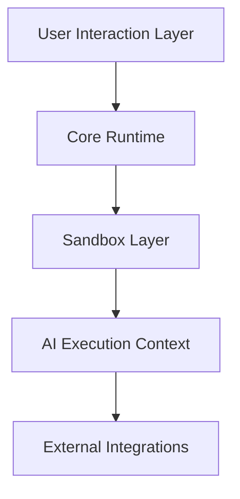
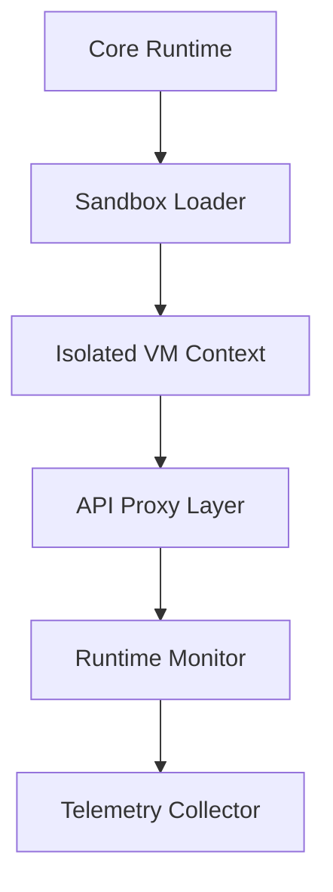

# 🛡️ **SpecRails Security Model & Sandbox Policy**

## 🎯 Цель

> Обеспечить архитектурную безопасность SpecRails при выполнении AI-интеракций, загрузке модулей и работе с контекстом, гарантируя отсутствие побочных эффектов, утечек данных и неконтролируемого доступа к окружению.

SpecRails использует **многоуровневую модель безопасности**, включающую sandbox-изоляцию, контроль API, валидацию целостности, разграничение контекста и динамическое управление доверенными зонами.

---

## 🧩 1. Архитектурные принципы безопасности

| Принцип                      | Описание                                                             |
| ---------------------------- | -------------------------------------------------------------------- |
| **Isolation First**          | Каждый модуль, контракт и AI-вызов выполняется в изолированной среде |
| **Least Privilege**          | Минимально необходимый доступ для каждой операции                    |
| **Immutable Context**        | Контекст AI не может быть изменён модулем напрямую                   |
| **Integrity by Default**     | Все компоненты подписаны и верифицируются перед загрузкой            |
| **Observability Boundaries** | Все действия в sandbox регистрируются и могут быть воспроизведены    |

---

## ⚙️ 2. Модель безопасности по уровням



| Уровень                    | Задача                                                    |
| -------------------------- | --------------------------------------------------------- |
| **User Interaction Layer** | Изолирует пользовательские команды и входные данные       |
| **Core Runtime**           | Выполняет код SpecRails SDK и контролирует доступ к API   |
| **Sandbox Layer**          | Ограничивает доступ модулей к системным ресурсам          |
| **AI Execution Context**   | Контролирует взаимодействие с AI-провайдерами             |
| **External Integrations**  | Безопасно обрабатывает CI/CD, Webhooks, Observability API |

---

## 🧱 3. Sandbox Execution Policy

Sandbox Policy определяет разрешённые API, время и объём памяти, доступные каждому модулю:

```yaml
sandbox_policy:
  cpu_limit_ms: 1000
  memory_limit_mb: 128
  timeout_ms: 5000
  allowed_apis:
    - "PromptAPI"
    - "ValidatorAPI"
    - "ContextAPI"
    - "PreviewAPI"
  restricted_modules:
    - "fs"
    - "net"
    - "child_process"
    - "http"
    - "os"
  io_access: false
  network_access: false
  telemetry_enabled: true
```

---

## 🔐 4. Execution Sandbox Architecture



Sandbox Loader создаёт виртуализированную среду исполнения для каждого модуля.
API Proxy Layer фильтрует все обращения к SDK и запрещает доступ к системным ресурсам вне белого списка.

---

## 🧩 5. Integrity & Trust System

Каждый модуль SpecRails подписан цифровым хэшем и проходит проверку перед активацией:

```yaml
integrity_record:
  module: "form.builder"
  version: "0.4.2"
  checksum: "e3b0c442..."
  signature: "RSA2048:MIICWwIBAAKBgQD..."
  verified: true
  timestamp: "2025-11-06T22:30:00Z"
```

**Проверяются:**

* целостность бинарных и YAML-файлов;
* подпись от доверенного издателя (SpecRails Team / Verified Partner);
* версия модуля и соответствие runtime manifest.

---

## ⚙️ 6. Контроль контекста и данных

### **Immutable Context Guard**

Контекст AI доступен только для чтения — утилита не может изменять значения полей напрямую.

```js
ContextAPI.on('write', (key) => {
  throw new Error(`Context mutation not allowed: ${key}`)
})
```

### **Data Access Policy**

AI получает только те данные, которые явно включены в context layer.

```yaml
data_access:
  allowed_domains: ["forms", "models"]
  restricted_domains: ["user_credentials", "billing"]
```

---

## 🧠 7. Runtime Threat Mitigation

| Угроза                      | Механизм защиты                           |
| --------------------------- | ----------------------------------------- |
| Выполнение стороннего кода  | Sandbox изоляция + API proxy              |
| Изменение контекста         | Immutable Context Guard                   |
| Утечка данных через AI      | Data Filter + Output Sanitizer            |
| Загрузка поддельных модулей | Integrity Verifier + Manifest Enforcement |
| Эскалация привилегий        | Least Privilege Policy                    |
| Неконтролируемая генерация  | Contract-bound AI Execution               |

---

## 🧩 8. Quarantine & Incident Handling

При нарушении политик безопасности модуль или процесс переводится в статус **quarantined**:

```yaml
incident_report:
  id: "QRT-2025-11-06-01"
  module: "model.designer"
  reason: "Unauthorized access to ContextAPI.write()"
  severity: "critical"
  action: "module quarantined"
  timestamp: "2025-11-06T22:32:00Z"
```

**Действия системы:**

* модуль выгружается из памяти;
* сессия AI блокируется;
* создаётся отчёт в Observability Layer;
* пользователь уведомляется о причинах.

---

## 📊 9. Безопасность AI Execution Layer

| Компонент              | Ограничение                                              |
| ---------------------- | -------------------------------------------------------- |
| **Prompt Contracts**   | AI не получает прямой доступ к исходному коду или файлам |
| **Context Filtering**  | Удаляются приватные данные и идентификаторы              |
| **Response Validator** | Проверяет формат и содержимое ответа AI                  |
| **Timeout Controller** | Принудительное завершение долгих запросов                |
| **Model Whitelist**    | Разрешённые AI-модели фиксируются в манифесте            |

---

## 🔍 10. Sandbox Telemetry

| Метрика                    | Назначение                                |
| -------------------------- | ----------------------------------------- |
| **Sandbox Violations**     | Нарушения политик API и безопасности      |
| **Execution Timeout Rate** | Доля запросов, превысивших лимиты времени |
| **Memory Usage Trends**    | Среднее потребление памяти по модулям     |
| **Integrity Failures**     | Ошибки проверки подписей                  |
| **Quarantine Events**      | Количество инцидентов безопасности        |

---

## 🧭 11. Архитектурный принцип

> **Безопасность — это не фильтр, а архитектурная форма мышления.**
> В SpecRails каждый слой — от AI до UI — живёт внутри границ доверия.
> Sandbox не ограничивает возможности разработчика, а гарантирует воспроизводимость и надёжность всей системы.
