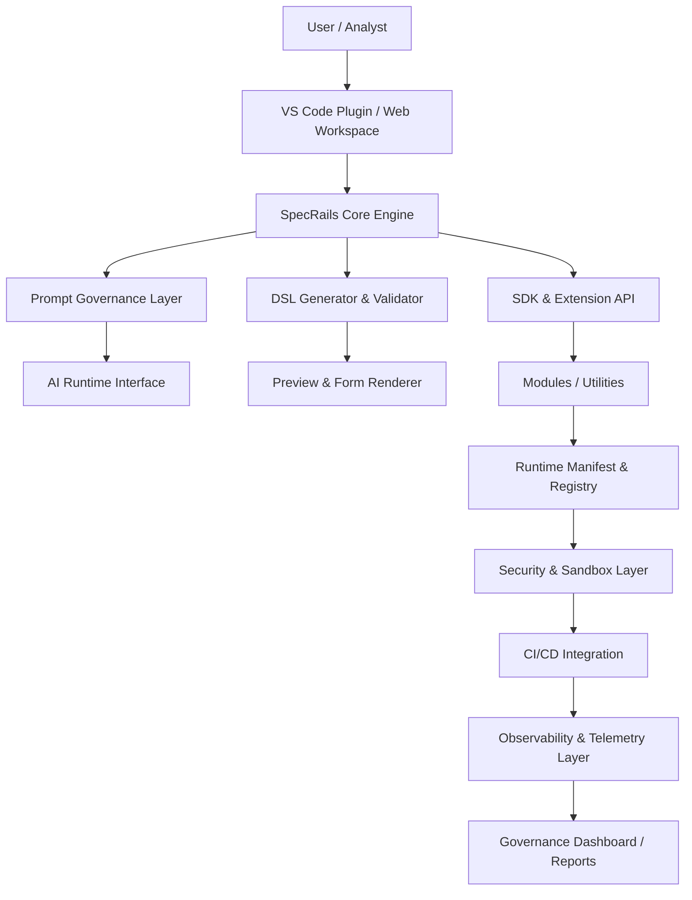

# 🏗️ **SpecRails System Overview — Final Architecture Blueprint**

## 🎯 Цель

> Представить целостную архитектуру SpecRails как многоуровневую систему, объединяющую генерацию спецификаций, AI-интеракции, валидацию, CI/CD и наблюдаемость в единую экосистему.

SpecRails — это **архитектурная рамка (framework)**, предназначенная для создания и сопровождения аналитических и инженерных артефактов (DSL-спецификаций) с помощью AI, но под контролем человека и воспроизводимой логики.

---

## 🧩 1. Архитектурная модель (высокий уровень)



---

## ⚙️ 2. Основные архитектурные слои

| Уровень                             | Описание                                                                                           |
| ----------------------------------- | -------------------------------------------------------------------------------------------------- |
| **Core Engine**                     | Центр обработки DSL и спецификаций, отвечает за структуру данных, валидацию и совместимость версий |
| **Prompt Governance Layer**         | Контракты, шаблоны и ограничения для взаимодействия с AI, обеспечивающие когнитивную стабильность  |
| **SDK & Extension API**             | Интерфейс для подключения утилит, расширений и кастомных модулей                                   |
| **Runtime Manifest & Registry**     | Управление версиями, зависимостями и активацией модулей во время выполнения                        |
| **Security & Sandbox Layer**        | Изоляция исполнения, контроль доступа и проверка целостности компонентов                           |
| **CI/CD Integration**               | Автоматизация валидации, drift-контроля и governance через DevOps-пайплайны                        |
| **Observability & Telemetry Layer** | Сбор метрик, логов, аудита и визуализация состояния системы                                        |

---

## 🧱 3. Внутренние модули ядра

| Модуль                  | Роль                                                            |
| ----------------------- | --------------------------------------------------------------- |
| **DSL Parser**          | Интерпретирует и валидирует спецификации (YAML/JSON/Markdown)   |
| **Prompt Orchestrator** | Управляет генерацией текстов, контрактами и контекстами для AI  |
| **Contract Validator**  | Проверяет, что все AI-ответы соответствуют заданным схемам      |
| **Preview Engine**      | Отображает визуальные представления форм и страниц из DSL       |
| **AI Adapter Hub**      | Подключает разные AI-провайдеры через унифицированный интерфейс |
| **Context Manager**     | Управляет памятью и контекстом аналитика / проекта              |

---

## 🔐 4. Контур безопасности

SpecRails использует двухуровневую модель безопасности:

1. **Static Security Layer** — контроль целостности модулей, sandbox, RBAC.
2. **Dynamic Trust Layer** — runtime-аудит, ограничения контекста и автоматическая изоляция при нарушениях.

```yaml
sandbox_policy:
  allowed_apis: ["PromptAPI", "ValidatorAPI", "ContextAPI"]
  memory_limit_mb: 128
  cpu_limit_ms: 1000
  io_access: false
```

---

## 🔄 5. Потоки данных и событий

```mermaid
graph LR
A[User Text] --> B[Prompt Contract]
B --> C[AI Execution]
C --> D[DSL Generation]
D --> E[Validation Engine]
E --> F[Preview UI]
F --> G[User Feedback]
G --> H[AI Refinement]
H --> I[Versioned Spec Commit]
I --> J[CI/CD Validation]
J --> K[Telemetry Stream]
K --> L[Governance Dashboard]
```



---

## ⚙️ 6. Взаимодействие AI и DSL

| Этап | Компонент          | Роль                                    |
| ---- | ------------------ | --------------------------------------- |
| 1️⃣  | Prompt Contract    | Определяет цель и контекст генерации    |
| 2️⃣  | AI Runtime         | Выполняет генерацию по контракту        |
| 3️⃣  | DSL Validator      | Проверяет результат по схеме и правилам |
| 4️⃣  | Preview Layer      | Отображает визуальное представление     |
| 5️⃣  | User Feedback Loop | Запускает дообучение и корректировку    |

---

## 🧠 7. Модульность и расширяемость

Каждый модуль SpecRails реализует контракт SDK:

```js
registerModule({
  name: 'form.builder',
  type: 'utility',
  version: '0.4.2',
  dependencies: ['@specrails/core'],
  setup(core) {
    core.registerUtility('form.builder', async (input) => {
      const dsl = await core.PromptAPI.executeContract('form.contract.v2', input)
      return core.ValidatorAPI.validate(dsl)
    })
  }
})
```

---

## 📊 8. Governance и Drift Control

Governance Engine контролирует стабильность AI через:

* **Drift Index** — измеряет отклонение между версиями спецификаций.
* **Approval Workflow** — требует подтверждения при изменении контрактов.
* **Audit Trail** — сохраняет цифровые следы всех изменений.

```yaml
drift_index: 0.032  # стабильность в пределах нормы
approval_required: true
audit_entry: "AUD-2025-11-06-01"
```

---

## 🔍 9. Observability & Telemetry

Observability Layer интегрируется с внешними системами:

* **Prometheus / Grafana** — метрики AI и runtime.
* **Elastic Stack** — анализ логов.
* **Slack / Teams** — уведомления и оповещения.

Пример метрик:

```yaml
telemetry:
  drift_stability_index: 0.024
  validation_pass_rate: 98%
  sandbox_violation_rate: 0%
  governance_compliance: 100%
```

---

## 📦 10. Потоки CI/CD

SpecRails CI/CD интегрируется с DevOps через CLI:

```bash
specrails validate --contracts all
specrails check drift --baseline v0.1
specrails audit export --format json
```

Pipeline может блокировать релиз, если:

* контракт невалиден;
* drift > 0.05;
* sandbox нарушен.

---

## 🧭 11. Архитектурный принцип

> **SpecRails — это не просто AI-инструмент, а инженерный стандарт.**
> Он делает генерацию спецификаций предсказуемой, безопасной и воспроизводимой,
> превращая работу аналитика с AI в управляемый процесс проектирования.
