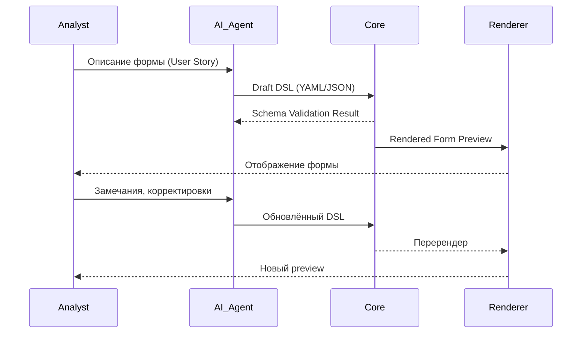

Да, именно так — ты очень точно описал суть **двухуровневой валидации**, вокруг которой можно построить всю философию SpecRails.

---

## ⚙️ Двухконтурная модель SpecRails Validation Loop

| Уровень                                           | Описание                                                                                                                                                      | Тип проверки                   | Участие человека |
| ------------------------------------------------- | ------------------------------------------------------------------------------------------------------------------------------------------------------------- | ------------------------------ | ---------------- |
| **1. Machine Validation (Core Validation Loop)**  | Проверка результата, сгенерированного AI, на структурную и логическую корректность. Использует JSON Schema, правила типов, допустимые атрибуты и зависимости. | Формальная (детерминированная) | ❌ Нет            |
| **2. Human Validation (Interactive Visual Loop)** | Аналитик смотрит на визуализированную форму (preview), замечает несоответствия контексту, правит вручную или инициирует новый prompt для AI.                  | Семантическая (контекстная)    | ✅ Да             |

---

## 🧩 Как это работает в цикле SpecRails

1. **AI агент** создаёт черновой DSL по user story.
2. **Core Engine** валидирует DSL — проверяет соответствие schema, синтаксис и целостность.

   * Если ошибка → возвращает AI агенту список нарушений с подсказками для коррекции.
3. **Renderer Layer** показывает аналитику визуальный результат (форма/страница).
4. **Аналитик** визуально валидирует смысл и UX.

   * Если несоответствие → сообщает агенту (“Сделай поле скрытым”, “Эту группу вынеси вверх”).
   * Агент обновляет DSL.
5. **Core снова валидирует** обновлённый DSL.

→ Это итерационный цикл *“AI ⇄ Core ⇄ Analyst”*.

---

## 🔁 Итеративная архитектура SpecRails Loop

---

## 🧠 Архитектурная философия этого подхода

1. **AI — генератор смысла**
   Он не контролирует структуру, только предлагает интерпретацию текста.

2. **Core — арбитр формальной истины**
   Только ядро решает, что “валидно” и что может быть принято как спецификация.

3. **Аналитик — арбитр смысловой истины**
   Только человек решает, что “соответствует бизнес-логике”.

4. **Валидация — замкнутая петля**
   Каждая ошибка или несоответствие возвращается либо AI, либо аналитику в удобной форме.

---

## 🔒 Результат — предсказуемость

| Параметр            | Что обеспечивает                                                        |
| ------------------- | ----------------------------------------------------------------------- |
| **Consistency**     | Любой AI или человек, при тех же входных данных, получит одинаковый DSL |
| **Transparency**    | Аналитик видит процесс и может вмешаться                                |
| **Quality Control** | Ошибки ловятся до передачи в разработку                                 |
| **Learning Loop**   | AI постепенно улучшает свои ответы на основании логов валидации         |

---

Если хочешь, я могу оформить это как концептуальный документ
📄 `SpecRails_Validation_Loop_Principle.md`
с этой двухконтурной моделью и схемой взаимодействия “AI ⇄ Core ⇄ Analyst”,
чтобы она стала частью общей архитектурной философии проекта.
Создать?
